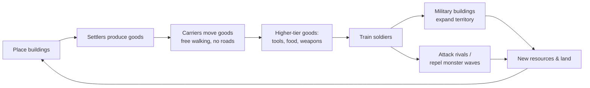

# 00 — Vision

## Game concept
**Rebuild** is a real-time city-building strategy game in the tradition of *The Settlers 4*. Players found a settlement on a randomly generated map, grow an economy of interlinked production chains operated by autonomous settlers, expand territory with military buildings, and defeat rivals and escalating monster waves. Player interaction is indirect: the player places buildings and sets priorities; settlers and carriers do the work.

Pillars:
1. **Satisfying economy** — visible goods flowing between buildings; bottlenecks are readable and fixable.
2. **Fair random maps** — every match is new, every start is equivalent ([03-mapgen](03-mapgen.md)).
3. **Rock-solid multiplayer** — deterministic lockstep, LAN + internet, up to 8 slots ([02-networking](02-networking.md)).
4. **Timeless, readable look** — low-poly 3D, small fixed palette, clear silhouettes ([07-art-style](07-art-style.md)).

## Core loop

Session length target: 45–90 min for a 4-player match on a medium map. ASSUMPTION: no persistent meta-progression.

## Release phases (user priority, 2026-10-02: "first of all its important to have a working version with lan support, after that comes steam and so on")
| Phase | Content | Details |
|---|---|---|
| **A — LAN Alpha** | 1 culture (Rivermen), economy, 3 warrior types with direct control, territory, fog, LAN multiplayer PvP | first playable goal |
| B — Cultures & war | 4 cultures, full unit roster, walls, gates, wall towers, palisades, siege | [10-cultures](10-cultures.md), [11-military](11-military.md) |
| C — Steam online | Steam internet play | user: "Cultures & walls first" (2026-10-02) |
| D — AI & monsters | AI players, monster waves, PvE/PvPvE | |
| E — Release | reconnect, MP save/load, polish, Linux build | |
Milestones and estimates: [09-roadmap](09-roadmap.md).

## MVP scope (= end of phase E; "full loop", per [USER-ANSWERS](handoff/USER-ANSWERS.md) Q7 and later answers)
| Area | In MVP |
|---|---|
| Map | Random map generator with all brief parameters, fairness validation, lobby preview, seed share/save |
| Economy | 24 shared buildings, 4 chains (construction, food, metal/tools, weapons) — see [06-economy](06-economy.md) |
| Cultures | 4 cultures with different costs, unique buildings/goods/units, strengths and weaknesses — [10-cultures](10-cultures.md) |
| Logistics | S4-style free-walking carriers, storehouses, build/transport priorities |
| Settlers | Residences produce settlers; professions require tools |
| Military | Direct unit control; 12 unit types (5 shared + 7 culture-specific), 3 ranks; castle, 2 tower sizes; palisades, stone walls, gates, wall towers; battering ram, catapult — [11-military](11-military.md) |
| Opponents | Host-side AI (easy/normal/hard) acting via commands — [05-ai](05-ai.md) |
| Monsters | Lairs in neutral zones spawning escalating waves — [04-game-modes](04-game-modes.md) |
| Visibility | Visual fog of war, shared vision between allies — [04-game-modes §1](04-game-modes.md) |
| Modes | PvE, PvP, PvPvE; free team assignment; slots: human / AI / monsters / open / closed |
| Multiplayer | LAN (ENet + discovery), internet via Steam; pause, disconnect, reconnect, AI takeover, save/load MP, game speed 1–3× |
| Platforms | Windows x64, macOS universal (ARM + x64); Linux x64 tested in CI from day one, shipped at release (user, 2026-10-02) |
| Art | Kenney CC0 low-poly placeholders behind an asset-mapping layer |

## Explicit non-goals (MVP)
- Campaign, story, scripted scenarios, map editor (saved generated maps only).
- More than 4 cultures.
- Ships, sea trade, magic/priests, trading between players.
- Spectator mode and replay viewer UI (replays exist as test artifacts only; per [USER-ANSWERS](handoff/USER-ANSWERS.md) Q10).
- Ranked matchmaking, accounts, cloud saves, anti-cheat beyond desync detection.
- Mobile, web, consoles.
- Custom relay server (planned post-MVP; abstraction exists from day one — [ADR 0004](decisions/0004-internet-transport.md)).
- Mod support (data-driven definitions make it possible later, not supported).

## Constraints recap
All non-negotiable constraints: [ORIGINAL-BRIEF §2](handoff/ORIGINAL-BRIEF.md). Team: solo developer, part-time (~10–15 h/week) — scope and roadmap are sized for that ([09-roadmap](09-roadmap.md)).
