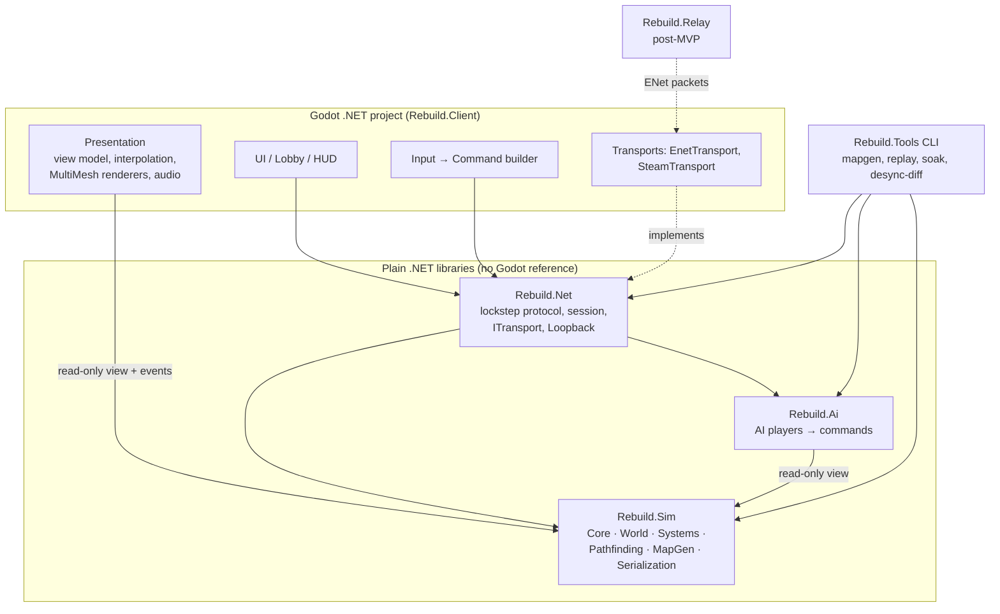
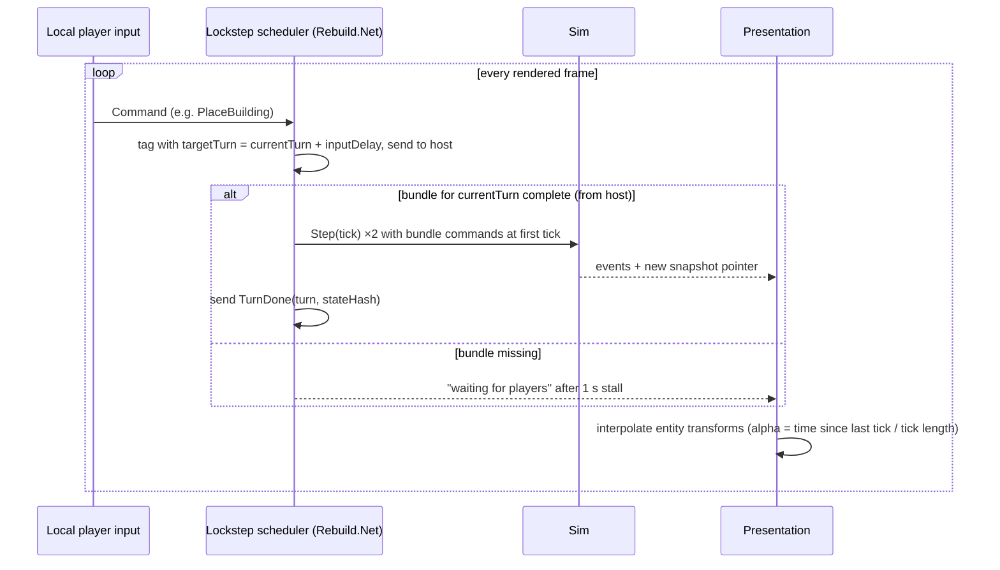
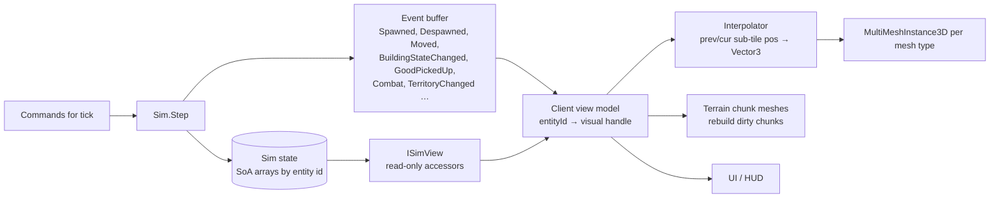

# 01 — Architecture

Related ADRs: [0001 language](decisions/0001-language.md) · [0002 fixed point](decisions/0002-fixed-point-format.md) · [0003 mapgen](decisions/0003-mapgen-determinism.md) · [0004 transport](decisions/0004-internet-transport.md) · [0006 sim conventions](decisions/0006-sim-core-conventions.md).

## 1. Principles
1. **The simulation is a pure function**: `State(n+1) = Step(State(n), Commands(n))`. Same inputs ⇒ same bits on every OS ([Gaffer — Deterministic Lockstep](https://gafferongames.com/post/deterministic_lockstep/)).
2. **Only commands cross the network**, never unit state ([1500 Archers](https://www.gamedeveloper.com/programming/1500-archers-on-a-28-8-network-programming-in-age-of-empires-and-beyond)). Exception (whole-state files, not continuous sync): savegame load and late reconnect, see [02-networking](02-networking.md) §6.
3. **Strict layering**: Sim knows nothing about Godot, networking, AI or rendering. Dependencies point inward only.
4. **Determinism is enforced by tooling, not discipline** — analyzers, golden hashes, cross-OS CI ([GDC 2024 Pollard](https://media.gdcvault.com/gdc2024/Slides/GDC+slide+presentations/Pollard_Bradley_CrossPlatformDeterminism+2024-03-26+09.34.19.pdf)).

## 2. Module structure



| Module | Type | Responsibility | May reference |
|---|---|---|---|
| `Rebuild.Sim` | `net8.0` class lib | Deterministic game state & rules: `Core` (Fix, Pcg32, XxHash wrapper, ids, ordered collections), `World` (tiles, height, terrain, resources, territory), `Entities` (settlers, buildings, goods, soldiers, monsters), `Systems` (construction, production, logistics, combat, fortifications, monsters, visibility, victory), `Cultures` (resolves culture data + modifiers into per-player tables at match start, [ADR 0007](decisions/0007-culture-system.md)), `Pathfinding`, `MapGen`, `Commands` (definitions + validation), `Serialization` (save/hash) | BCL only (analyzer-restricted) |
| `Rebuild.Ai` | `net8.0` class lib | Computer players; reads `ISimView`, emits `Command`s. Runs on host only ([05-ai](05-ai.md)) | Sim |
| `Rebuild.Net` | `net8.0` class lib | Lobby/session model, lockstep scheduler, command bundles, ack/redundancy, desync detection, `ITransport` + `LoopbackTransport` | Sim (commands, hash), Ai (host runs AI) |
| `Rebuild.Client` | Godot .NET project | Rendering, input, UI, audio, ENet/Steam transports, LAN discovery, settings | all libs |
| `Rebuild.Tools` | .NET console | Headless: `mapgen` (seed→hash/PNG), `replay` (log→hash), `soak` (AI vs AI), `desync-diff` | Sim, Net, Ai |
| `Rebuild.Relay` | .NET console (post-MVP) | Room-based packet forwarding ([ADR 0004](decisions/0004-internet-transport.md)) | Net (protocol framing only) |

Sim-assembly guards (Roslyn [BannedApiAnalyzers](https://github.com/dotnet/roslyn-analyzers/blob/main/src/Microsoft.CodeAnalysis.BannedApiAnalyzers/BannedApiAnalyzers.Help.md) + a small custom analyzer):
`float`, `double`, `decimal`, `System.Math` float APIs, `System.Random`, `DateTime`, `Stopwatch`, `Environment.TickCount`, `Thread`, `Task`, `Parallel`, `ThreadPool`, `async`, `Dictionary`/`HashSet` enumeration (`GetEnumerator`, `Keys`, `Values`, LINQ over them), `GetHashCode()` of strings/objects as data, `unsafe`, reflection-based serialization, two RNG calls in one expression.

## 3. Tick loop

Constants ([ADR 0006](decisions/0006-sim-core-conventions.md)): tick = 100 ms at 1×, turn = 2 ticks, default input delay = 2 turns.



- Wall-clock pacing: the scheduler accumulates real time × game speed; it runs at most `maxCatchUpTicks = 4` ticks per frame to avoid spirals.
- **Sim budget:** ≤ 20 ms per tick for the economy at 8 players / 5 000 settlers, plus ≤ 10 ms for combat with 6 400 soldiers ([11-military §7](11-military.md)), on the reference machine (**MacBook with Apple M5, 24 GB RAM** — the developer's machine, [USER-ANSWERS](handoff/USER-ANSWERS.md) 2026-10-02; the developer's Windows gaming PC is the second test machine). Since the M5 is fast, budgets must also be checked on a weaker CI runner (trend only). Exceeding it is a performance bug.
- Sim runs on the main thread in MVP. ASSUMPTION: if frame pacing suffers, move the whole sim (still single-threaded) to one worker thread with a double-buffered view — allowed because no threads exist *inside* the sim.

## 4. Command model

```text
Command {
  ushort  Type          // enum CommandType
  byte    Slot          // issuing slot (0..7); 255 = system/host
  uint    TargetTurn    // turn at which it executes
  ushort  Seq           // per-slot sequence, for dedupe & ordering
  byte[]  Payload       // type-specific, little-endian, versioned
}
```
- **Execution order inside a turn**: sorted by `(Slot, Seq)` — deterministic regardless of arrival order.
- **Validation happens in the sim** (`Commands.Validate(state, cmd)`): invalid commands (e.g. building on enemy land) become no-ops identically on all peers. The client pre-validates only for UI feedback.
- Command catalogue (MVP):

| Group | Commands |
|---|---|
| Building | `PlaceBuilding(type, tile, rotation)`, `CancelConstruction(id)`, `Demolish(id)`, `SetBuildingPaused(id, bool)` |
| Economy | `SetTransportPriority(goodType, rank)`, `SetToolProductionQuota(tool, n)`, `SetFoodDistribution(target, pct)`, `SetStorePolicy(storeId, good, accept/reject)` |
| Military | `Move`, `AttackMove`, `Attack(target)`, `Stop`, `Hold`, `SetStance`, `Garrison`, `Ungarrison`, `Train`, `BuildWall`, `BuildGate`, `SetGateLocked` — payloads in [11-military §2](11-military.md) (unit id lists ≤ 200) |
| Meta (from host, Slot=255) | `PlayerJoined`, `PlayerLeft(slot)`, `AiTakeover(slot, difficulty)`, `HumanResume(slot)`, `Pause`, `Resume`, `SetSpeed(k)`, `Surrender(slot)` |

## 5. Fixed-point strategy (summary of [ADR 0002](decisions/0002-fixed-point-format.md))
- Prefer domain integers: tiles (`short`), sub-tile positions (1 tile = 256 units, `int`), ticks (`int`), quantities (`int`), probabilities in 1/65 536.
- Fractional math via `Fix` (Q48.16 in `long`), floor rounding, `Int128` intermediate for mul/div, integer sqrt, lookup-table trig only if ever needed.
- Distances: octile integer metric (10/14) for movement cost; squared Euclidean (`long`) for radius checks — no sqrt needed.
- Conversion to `float` exists only in `Rebuild.Client` (`ToRenderFloat()`).

## 6. RNG (summary of [ADR 0006](decisions/0006-sim-core-conventions.md))
- `Pcg32` struct; streams per subsystem seeded with `SplitMix64(matchSeed ^ streamId)`; `MapGen` uses `mapSeed` (independent of `matchSeed`, so the same map can be replayed with a different match RNG).
- RNG state is part of the sim state → serialized and hashed.
- API: `NextUInt()`, `NextInt(maxExclusive)` (Lemire's unbiased bounded method, [Lemire 2019](https://arxiv.org/abs/1805.10941)), `Chance(partsPer65536)`.

## 7. Data flow: simulation → rendering


- Sim never calls the client. The client polls `ISimView` and drains the event buffer after each tick.
- Movement events carry `(entityId, fromSubPos, toSubPos, ticks)` so the client interpolates without reading state every frame.
- The view model is the only place that converts fixed-point to `float`.

## 8. State, hashing, saves
- State layout: structure-of-arrays per entity kind, indexed by dense slot, plus `id → slot` lookup (lookup-only dictionary). Iteration always over dense arrays in id order.
- **Canonical serialization** (explicit field order, little-endian, no padding, no reflection) is used for: save files, state hash (XxHash64), reconnect snapshots, desync dumps.
- **Visibility** (fog of war) is sim state: per team an `explored` bitset and a `visibleCount` grid (byte per tile), updated incrementally when vision sources change tile (buildings, soldiers, territory edges; carriers inside own territory add nothing new). Deterministic and hashed because the AI reads it.
- Savegame = `{GameVersion, MapSpec, SlotTable, Turn, SimState}`; MP save/load described in [02-networking](02-networking.md).

## 9. Repository folder structure (target)
```
/
├─ AGENTS.md, CLAUDE.md, README.md
├─ docs/                         planning docs, ADRs, handoff
├─ src/
│  ├─ Rebuild.Sim/               net8.0, no Godot
│  │  ├─ Core/  World/  Entities/  Systems/  Pathfinding/
│  │  ├─ MapGen/  Commands/  Serialization/
│  │  └─ BannedSymbols.txt
│  ├─ Rebuild.Ai/
│  ├─ Rebuild.Net/
│  ├─ Rebuild.Tools/
│  ├─ Rebuild.Relay/             post-MVP
│  └─ Rebuild.Analyzers/         custom determinism analyzers
├─ client/                       Godot project (project.godot, Rebuild.Client.csproj)
│  ├─ scenes/  scripts/  ui/  shaders/
│  └─ assets/                    art behind asset-mapping table (see 07-art-style)
├─ data/                         building/good/unit definitions (JSON → generated C# tables)
│  └─ cultures/<id>/             per-culture data packages (ADR 0007)
├─ tests/
│  ├─ Rebuild.Sim.Tests/  Rebuild.Net.Tests/  Rebuild.Ai.Tests/
│  └─ golden/                    map hashes, replay logs + expected hashes
├─ tools/                        scripts (CI helpers, asset import)
└─ .github/workflows/            CI matrix (see 08-testing)
```
Data definitions (buildings, goods, recipes) live in `data/*.json` and are compiled into C# tables at build time by a source generator, so the sim never parses JSON at runtime and definition order is fixed. ASSUMPTION: the data hash is part of `GameVersion` so mismatched data blocks joining a lobby.
