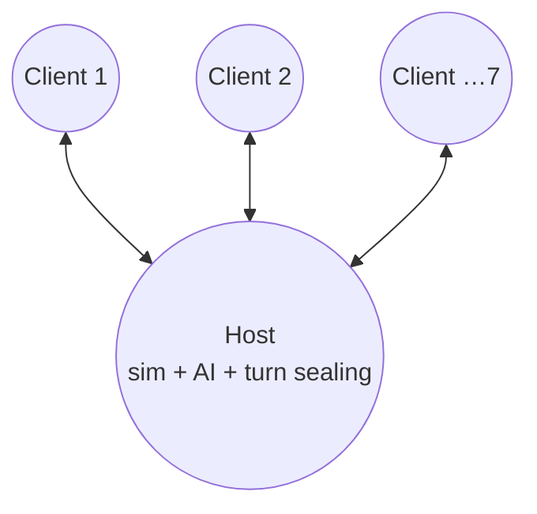
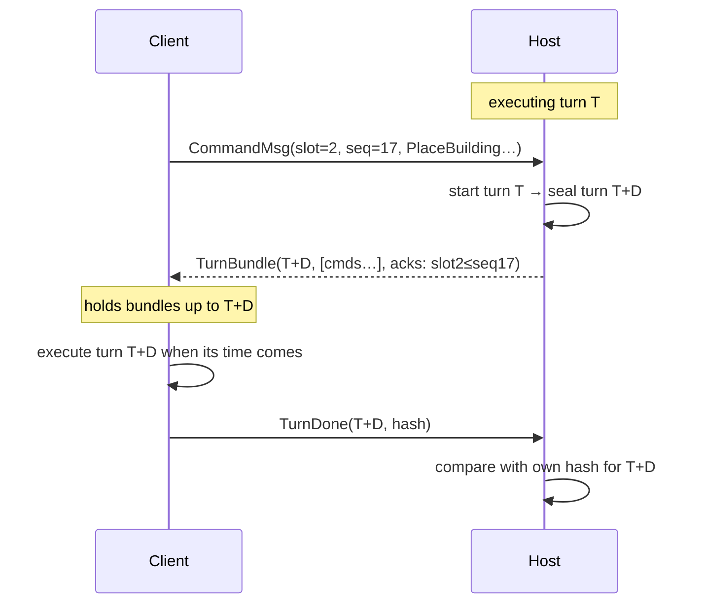

# 02 — Networking

Related: [01-architecture](01-architecture.md) · [ADR 0004 transport](decisions/0004-internet-transport.md) · [ADR 0006 tick/turn](decisions/0006-sim-core-conventions.md).

## 1. Model
- **Deterministic lockstep, host-centred star.** Every peer (host included) runs the full sim. Only commands, acks, hashes and lobby/control data travel ([1500 Archers](https://www.gamedeveloper.com/programming/1500-archers-on-a-28-8-network-programming-in-age-of-empires-and-beyond), [Gaffer](https://gafferongames.com/post/deterministic_lockstep/)).
- **Host** = the player who created the lobby. It also runs AI slots ([05-ai](05-ai.md)), seals turns, compares hashes, and issues meta commands. No dedicated server in MVP.
- Max 8 slots; ASSUMPTION: ≤ 8 connected humans (AI and monster slots need no connection).


Why star instead of mesh: one authority orders commands (no consensus), NAT/relay only needs host connections, and hash comparison/blame is central — *Realms of Ruin* uses the same idea with a server that "blames clients" on desync ([GDC 2024 Pollard](https://media.gdcvault.com/gdc2024/Slides/GDC+slide+presentations/Pollard_Bradley_CrossPlatformDeterminism+2024-03-26+09.34.19.pdf)).

## 2. Lockstep flow (host-sealed turns)
Constants: tick 100 ms, turn = 2 ticks = 200 ms at 1×, input delay `D` turns (default 2, adaptive 1–5).

1. A client sends `CommandMsg(slot, seq, payload)` to the host immediately (no target turn chosen by the client).
2. The host keeps an open bucket for the **earliest unsealed turn**. When the host *starts executing* turn `T`, it **seals turn `T + D`**: all commands received so far go into `TurnBundle(T+D)`, sorted by `(slot, seq)`, plus any meta commands.
3. The host broadcasts the bundle; clients store it.
4. Any peer may execute turn `T` only when it holds `TurnBundle(T)`. Otherwise it **stalls** (shows "waiting for host" after 1 s).
5. After executing turn `T`, each peer sends `TurnDone(T, stateHash)`.


Properties: late commands are never rejected, just sealed into a later turn; clients never stall for *each other*, only for the host's bundle; command latency ≈ `D × 200 ms` + RTT/2, inside the 250–500 ms range RTS players accept ([1500 Archers](https://www.gamedeveloper.com/programming/1500-archers-on-a-28-8-network-programming-in-age-of-empires-and-beyond)).

### Reliability
- Lockstep messages go on an **unreliable channel with own redundancy**: clients resend all unacked commands in every packet (every 50 ms) and the host resends all bundles not yet acknowledged by `TurnDone`. Under packet loss this beats reliable ordered streams, which stall on head-of-line blocking ([Gaffer](https://gafferongames.com/post/deterministic_lockstep/), [Pollard](https://media.gdcvault.com/gdc2024/Slides/GDC+slide+presentations/Pollard_Bradley_CrossPlatformDeterminism+2024-03-26+09.34.19.pdf)).
- Lobby/control/file transfer use the transport's reliable ordered channel.

## 3. Adaptive input delay & pacing
- Host measures per-client RTT and jitter with `Ping/Pong` (every 500 ms, EWMA).
- `D = clamp(ceil((maxRTT/2 + 2·jitter + 30 ms) / turnMs) , 1, 5)`. Changes are announced in a bundle and take effect at a future turn, so all peers switch at the same turn. Increase immediately, decrease slowly (one step per 10 s) — consistency over speed ([1500 Archers](https://www.gamedeveloper.com/programming/1500-archers-on-a-28-8-network-programming-in-age-of-empires-and-beyond)).
- **Slow machines**: each `TurnDone` reports average tick time. If a peer cannot keep up, the host lowers effective game speed for everyone (announced via `SetSpeed` meta command) rather than letting that peer fall behind. ASSUMPTION: show a "slow peer" indicator.
- **Catch-up**: if a client has several bundles buffered (e.g. after a hitch) it runs up to 4 ticks per frame until it is at most `D` turns behind the host.

## 4. Desync detection
- After every turn each peer computes `XxHash64` over the canonical state serialization ([ADR 0006](decisions/0006-sim-core-conventions.md)); budget ≤ 1 ms. If profiling shows more, hash a cheap summary every turn and the full state every 10 turns.
- Host compares each `TurnDone(T, hash)` against its own hash for `T`. The host is the reference.
- On mismatch:
  1. Host issues `Pause` (meta command) and broadcasts `DesyncDetected(T, slots)`.
  2. Every peer writes a **desync dump**: canonical state of turn `T` as structured text + the full command log + map spec — the approach Widelands uses with "syncstream" files ([Widelands issue #6962](https://github.com/widelands/widelands/issues/6962)) and Pollard with XML state dumps.
  3. Desynced client is re-synced via the reconnect path (§6, snapshot from host). The user is told a bug report was saved.
  4. `Rebuild.Tools desync-diff` compares dumps field by field and reports the first differing entity/field.

## 5. Pause, game speed
| Action | Who | Mechanism |
|---|---|---|
| Pause / resume | any human (host can always override) | `PauseRequest` → host emits `Pause` meta command at next sealed turn. ASSUMPTION: max 3 pauses per player, 120 s each, host unlimited. |
| Game speed 1×/2×/3× | host only | `SetSpeed(k)` meta command; sim unchanged, wall-clock ticks/second × k ([USER-ANSWERS](handoff/USER-ANSWERS.md) Q10) |
| Auto speed cap | host | if slowest peer can't keep up (§3) |

## 6. Disconnect, AI takeover, reconnect, host loss
| Event | Behaviour |
|---|---|
| Client silent > 5 s | Host stops sealing turns → everyone stalls; dialog "Waiting for *X*" with 60 s countdown (host can act earlier). |
| Timeout or host chooses | Host emits `PlayerLeft(slot)` + `AiTakeover(slot, Normal)` meta commands; the AI ([05-ai](05-ai.md)) now issues commands for that slot from the host ([USER-ANSWERS](handoff/USER-ANSWERS.md) Q10). Game continues. |
| Player reconnects (same Steam ID or session token) | Host sends: snapshot (savegame at last turn `T`, compressed) + bundles `T+1 … now`. Client loads, fast-forwards, verifies hash, then host emits `HumanResume(slot)` and AI control ends. |
| Host leaves / crashes | MVP: match ends for all; every client auto-saves locally (all have the full state), so the match can be resumed later via MP load. Host migration is post-MVP ([open-questions](open-questions.md)). |

Snapshot transfer is a one-time file transfer for recovery, not continuous state sync; replaying the full command log from turn 0 would take minutes on long matches. Confirmed by the user on 2026-10-02 as compatible with the "commands only" constraint ([USER-ANSWERS](handoff/USER-ANSWERS.md) D1).

## 7. Save / load in multiplayer
- **Save:** host (or any player via request) triggers `SaveGame(name)` meta command at turn `T`; every peer writes the identical savegame locally after turn `T` and reports its hash.
- **Load:** host picks a savegame in the lobby; lobby shows the saved slot table; players claim their old slots (missing humans → AI). Clients without the file, or with a differing hash, receive it from the host over the bulk channel.

## 8. Transport abstraction
```text
interface ITransport {
  Listen(config) / Connect(address)            // address: IP:port | SteamID | relay room code
  Send(PeerId, Channel, ReadOnlySpan<byte>)
  Poll() -> events: Connected, Disconnected, Received(PeerId, Channel, bytes)
  Stats(PeerId) -> rtt, loss
}
enum Channel { Control /*reliable ordered*/, Lockstep /*unreliable*/, Bulk /*reliable, chunked*/ }
```
| Implementation | Library | Use |
|---|---|---|
| `LoopbackTransport` | in-memory, configurable latency/loss | unit tests, soak tests, single-player (same code path as MP) |
| `EnetTransport` | Godot [`ENetConnection`](https://docs.godotengine.org/en/stable/classes/class_enetconnection.html) low-level API (no RPC) | LAN, direct IP, port forwarding |
| `SteamTransport` | [Steamworks.NET](https://github.com/rlabrecque/Steamworks.NET) → `ISteamNetworkingSockets` P2P over SDR ([Steam docs](https://partner.steamgames.com/doc/features/multiplayer/steamdatagramrelay)) | internet default |
| `RelayTransport` (post-MVP) | ENet client to `Rebuild.Relay` | non-Steam internet / fallback |

Single-player uses the same lockstep path with a local host and `LoopbackTransport`, so SP and MP never diverge.

## 9. Message catalogue (protocol v1)
| Message | Dir | Channel | Content |
|---|---|---|---|
| `Hello` | C→H | Control | protocol version, `GameVersion` (incl. data hash), player name, token |
| `LobbyState` | H→C | Control | slots, teams, map params, seed, host settings |
| `LobbyAction` | C→H | Control | claim slot, ready, chat |
| `MapHash` | C→H | Control | hash of locally generated map ([ADR 0003](decisions/0003-mapgen-determinism.md)) |
| `FileChunk` | H→C | Bulk | map data / savegame / snapshot |
| `Start` | H→C | Control | match seed, start time, initial `D` |
| `CommandMsg` | C→H | Lockstep | slot, seq, payload (redundant until acked) |
| `TurnBundle` | H→C | Lockstep | turn, commands, meta commands, acks |
| `TurnDone` | C→H | Lockstep | turn, state hash, avg tick time |
| `Ping`/`Pong` | both | Lockstep | timestamps |
| `DesyncDetected` | H→C | Control | turn, affected slots |

Bandwidth estimate: 8 players, ≤ 5 commands/s each, ~20 B per command, bundles every 200 ms → < 2 KB/s at the host. Not a constraint.

## 10. LAN discovery
- Host broadcasts `LanBeacon {gameVersion, lobbyName, slotsFree, port}` every 1 s via UDP broadcast on a fixed port (ASSUMPTION: 47800) using Godot [`PacketPeerUDP.set_broadcast_enabled`](https://docs.godotengine.org/en/stable/classes/class_packetpeerudp.html); clients list beacons seen in the last 3 s.
- Manual "join by IP" as fallback (some networks block broadcast).

## 11. Lobby
- Slot table: per slot `type ∈ {Open, Closed, Human, AI(difficulty), Monsters}`, team id, color; see [04-game-modes](04-game-modes.md).
- Map panel: parameters ([03-mapgen](03-mapgen.md)), seed field with **copy** / **paste** / **randomize**, map preview image (generated locally from the seed), **save map** button (stores `MapSpec` + generated map file).
- Start conditions: all humans ready, all versions equal, all `MapHash` equal (or transfer complete).
- Internet: Steam lobby (invite friends, lobby browser); lobby metadata carries host Steam ID and game version.

## 12. Security & cheating (scope)
Lockstep exposes full state to every client, so the MVP fog of war is visual only (maphack possible with a modified client); MVP accepts this. Commands are validated in the sim, so illegal commands are no-ops for everyone. Desync detection also catches modified clients ([Pollard](https://media.gdcvault.com/gdc2024/Slides/GDC+slide+presentations/Pollard_Bradley_CrossPlatformDeterminism+2024-03-26+09.34.19.pdf)).
