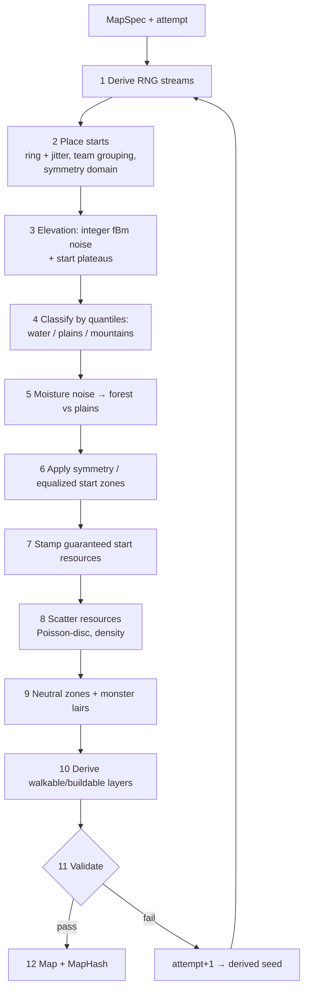

# 03 — Random Map Generation

Related: [ADR 0003 determinism](decisions/0003-mapgen-determinism.md) · [ADR 0002 fixed point](decisions/0002-fixed-point-format.md) · [ADR 0006 RNG](decisions/0006-sim-core-conventions.md) · brief requirements: [ORIGINAL-BRIEF §3](handoff/ORIGINAL-BRIEF.md).

## 1. Principles
- Lives in `Rebuild.Sim/MapGen`; integer/`Fix` math only, own RNG, single thread, no unordered iteration → **same `MapSpec` + `GeneratorVersion` = bit-identical map on every OS**.
- **Starts first, terrain second**: start positions are chosen early and the terrain is shaped around them, so fairness is constructed rather than hoped for.
- Every map is validated; on failure the generator retries with a **derived seed** — fully deterministic.

## 2. Parameters (`MapSpec`)
| Parameter | Type / range | Default | Notes |
|---|---|---|---|
| `Seed` | `ulong` | random | |
| `Size` | S 192², M 256², L 384², XL 512² tiles | M | XL = brief's largest, [USER-ANSWERS](handoff/USER-ANSWERS.md) Q8 |
| `PlayerCount` | 2–8 (non-monster slots that need a start) | 2 | |
| `TeamLayout` | team id per start (e.g. `[0,0,1,1]`) | FFA | teammates get adjacent starts |
| `TerrainMix` | % water / mountains / forest / plains, sum 100 | 15/15/25/45 | exact via quantiles (§3 step 4) |
| `ResourceDensity` | Low / Normal / High | Normal | scales deposit count & size outside start zones |
| `Symmetry` | None / Mirror (2 starts or 2 teams) / Rotational (4 starts) / Equalized (any count) | Equalized | §4 |
| `MonsterDensity` | None / Low / Medium / High | None (PvP), Medium (PvPvE) | number of lairs, see [04-game-modes](04-game-modes.md) |
| `GeneratorVersion` | `ushort` | current | bump on any algorithm change |

**Share code:** `MapSpec` is packed to bytes and encoded as Crockford base32 with a checksum, e.g. `RB1-7Q3K-…`. Copy/paste of this one string reproduces seed + all parameters + version ([ORIGINAL-BRIEF §3](handoff/ORIGINAL-BRIEF.md) "seed copyable and shareable").

## 3. Pipeline

| # | Step | Detail |
|---|---|---|
| 1 | RNG streams | `s = SplitMix64(Seed ^ attempt·φ)`; independent `Pcg32` streams per step (starts, elevation, moisture, resources, lairs) so tuning one step does not reshuffle others ([ADR 0006](decisions/0006-sim-core-conventions.md)). |
| 2 | Starts | Positions on an ellipse at radius ≈ 0.35·size with angular jitter; teams occupy contiguous angle sectors; min distance `Dmin = size·0.6/√players` (ASSUMPTION, tuned in spike S4). Symmetric modes place one start in the fundamental domain and map it. |
| 3 | Elevation | Integer value noise: lattice values from a 32-bit integer hash of `(x, y, seed)` ([Eiserloh, GDC 2017](https://www.gdcvault.com/play/1024365/Math-for-Game-Programmers-Noise)); integer smoothstep interpolation; 5 octaves fBm summed in `int`. Approach per [Red Blob Games — terrain from noise](https://www.redblobgames.com/maps/terrain-from-noise/). Radial plateau (flat, buildable land) blended in around each start (radius `Rstart` = 20 tiles). |
| 4 | Quantile classification | Integer histogram of elevations; thresholds chosen so the water and mountain shares match `TerrainMix` exactly (±0.5 %). |
| 5 | Moisture | Second noise field; among non-water/non-mountain tiles, the most moist `forest%` become forest (trees), rest plains. |
| 6 | Symmetry | *Mirror/Rotational*: generate fundamental domain, copy mirrored/rotated (exact). *Equalized*: one start-zone template (radius `Rzone` = 28) generated once and stamped (rotated in 90° steps) at every start, blended into the surrounding random terrain. *None*: no stamping (fairness still validated). |
| 7 | Guaranteed start resources | In each start zone deterministic placement of: forest patch, stone outcrop, small mountain with coal + iron (+ gold on L/XL), fish pond or coast, game animals, fertile plains. Positions relative to the start, rotated per start. |
| 8 | Global resources | Deposits via Bridson Poisson-disc sampling on an integer grid ([Bridson 2007](https://www.cs.ubc.ca/~rbridson/docs/bridson-siggraph07-poissondisk.pdf), [Red Blob — point sets](https://www.redblobgames.com/x/1830-jittered-grid/)); ore only in mountains, stone on hills/mountain edges, fish in water near land; count × `ResourceDensity`. |
| 9 | Neutral zones & lairs | Multi-source BFS distance field from all starts (integer). Neutral zone = land tiles with distance ≥ `Lmin` (default 40 tiles). Lairs placed by Poisson-disc in neutral zones, count from `MonsterDensity` × map area; preference for maxima of the distance field that are **equidistant** to starts. |
| 10 | Derived layers | Walkable (land, slope ≤ 2 height units to neighbours), buildable (walkable + slope ≤ 1 + free of objects), region id per land component. |
| 11 | Validate | See §5. |
| 12 | Output | `MapData` layers + `MapHash = XxHash64(canonical serialization)`. |

Map data per tile: `height:byte, terrain:byte, object:byte (tree/stone/…), resource:byte, amount:byte` (+ derived flags, not hashed separately). 512² × 5 B ≈ 1.3 MB.

## 4. Fairness model
Applied to every start `i`, radius `Rf = 24` tiles (ASSUMPTION, tune in spike S4):

| Metric | Definition | Pass criterion |
|---|---|---|
| F1 Start distance | min octile distance between any two starts | ≥ `Dmin` |
| F2 Buildable land | buildable tiles within `Rf` | ≥ 600 and max/min ratio across starts ≤ 1.10 |
| F3 Wood | tree count within `Rf` | ≥ 80 and ratio ≤ 1.10 |
| F4 Stone | stone units within `Rf` | ≥ 60 and ratio ≤ 1.10 |
| F5 Ore | coal + iron deposit units within `Rf + 8` (mountains may sit at edge) | each ≥ threshold, ratio ≤ 1.15 |
| F6 Food | fish units + game + fertile tiles within `Rf` | ≥ threshold, ratio ≤ 1.15 |
| F7 Connectivity | all starts in the same land region (flood fill) | required |
| F8 Opponent path fairness | land path length (A*, [06-economy](06-economy.md)) from each start to its nearest enemy start | max/min ≤ 1.20 |
| F9 Lair distance | min distance start → lair | ≥ `Lmin`; max/min across starts of nearest-lair distance ≤ 1.25 |
| F10 Lair reachability | every lair reachable by land from some start | required |
| F11 Terrain mix | realised % vs requested | within ±2 % |

Symmetric (mirror/rotational) maps pass F2–F6, F8, F9 by construction; checks still run as regression guards.

## 5. Validation & deterministic retry
- `Validate(map) → ValidationReport { passed, failedMetrics[], values[] }`.
- On failure: `attempt += 1`, regenerate with derived seed (step 1). Max 16 attempts.
- If all fail: return the best attempt? **No** — return `MapGenError(report)` and the lobby shows which metric failed and suggests parameter changes. This keeps "every played map passed validation" true.
- The final `attempt` is stored in the map file and shown in the lobby debug info; it is fully determined by the `MapSpec`.

## 6. Lobby integration
- Preview: client renders a top-down image from `MapData` (terrain colors, start markers with team colors, lair icons) — generation runs in the background in the lobby; host and clients all generate locally ([ADR 0003](decisions/0003-mapgen-determinism.md)).
- Seed/share code: copy, paste, randomize buttons.
- **Save map**: writes `<name>.rbmap` = header `{GameVersion, GeneratorVersion, MapSpec, attempt, MapHash}` + compressed layers. Loading a saved map does not regenerate; it uses the stored layers (so maps survive generator version bumps).

## 7. Performance targets
| Target (reference machine = developer's Apple Silicon Mac, single thread; see [01-architecture §3](01-architecture.md)) | Value |
|---|---|
| XL 512², 8 players, one attempt incl. validation | **≤ 1.5 s** |
| XL worst case incl. retries (p99 over 1 000 seeds) | **≤ 4 s** |
| M 256² one attempt (lobby preview responsiveness) | ≤ 0.4 s |
| Peak memory XL | ≤ 64 MB |
| First-attempt pass rate (1 000 random seeds per size) | ≥ 90 % |

Measured by `Rebuild.Tools mapgen --bench` in nightly CI ([08-testing](08-testing.md)).

## 8. Tests
- **Golden hashes**: `tests/golden/mapgen.json` with ~24 `(MapSpec → MapHash)` cases covering all sizes, player counts 2–8, every symmetry, monster densities. Must pass identically on Windows x64, macOS ARM64, Linux x64 ([08-testing](08-testing.md)). Any intentional change → bump `GeneratorVersion` and regenerate goldens in the same commit.
- **Property tests** (nightly, 1 000 seeds/size): validation passes after retries; metrics within bounds; runtime within targets.
- **Noise unit tests**: integer hash and fBm output against checked-in reference values.
