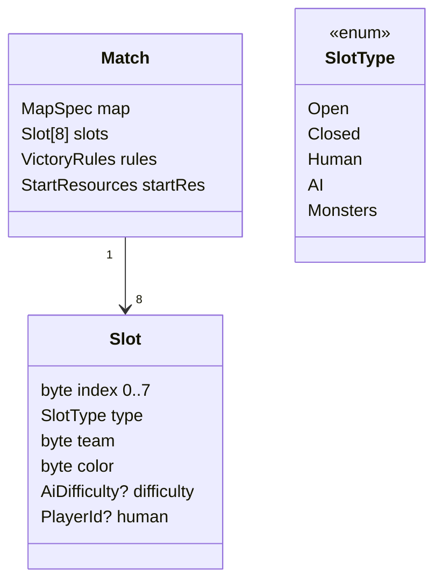

# 04 — Game Modes, Slots, Teams, Victory

Related: [02-networking §11 lobby](02-networking.md) · [03-mapgen](03-mapgen.md) · [05-ai](05-ai.md) (AI and monster behaviour).

## 1. Slot & team model

| Rule | Value |
|---|---|
| Slots | 8 per match ([USER-ANSWERS](handoff/USER-ANSWERS.md) Q8) |
| Slot types | `Open` (joinable), `Closed`, `Human`, `AI(Easy/Normal/Hard)`, `Monsters` |
| Start positions | one per `Human`/`AI` slot; `Monsters` needs none (uses lairs) |
| Monsters slot | at most one per match; implicitly its own team, hostile to everybody; present ⇔ `MonsterDensity ≠ None` |
| Teams | free assignment of team ids 1–8 to Human/AI slots; same id = allies; every slot may be its own team (FFA) |
| Allies | cannot attack each other, share vision and territory borders do not block each other's carriers; economies, stocks and soldiers stay separate. ASSUMPTION — confirm in [open-questions](open-questions.md). |
| Disconnected human | slot becomes AI-controlled until reconnect ([02-networking §6](02-networking.md)) |

## 2. Modes (derived from the slot table)
The lobby shows the mode as a label; there is no separate mode switch.

| Mode | Condition | Typical setup |
|---|---|---|
| **PvE** | all humans in one team; opponents are AI and/or Monsters | co-op vs AI, single-player vs AI, survival vs monsters |
| **PvP** | ≥ 2 teams containing humans (AI allowed as team-mates/opponents); no Monsters slot | 1v1, 2v2, FFA |
| **PvPvE** | ≥ 2 teams containing humans **and** a Monsters slot | competitive with neutral pressure |

## 3. Match settings
| Setting | Options | Default |
|---|---|---|
| Victory condition | Conquest / Survival (N waves) / Lair hunt | Conquest (PvP, PvPvE), Survival (PvE with monsters only) |
| Survival waves `N` | 10 / 15 / 20 / 30 | 15 |
| Start resources | Low / Normal / High | Normal |
| Monster density | from `MapSpec` ([03-mapgen §2](03-mapgen.md)) | — |
| Monster grace period | 10 / 15 / 20 min before first wave | 15 min |
| Game speed | 1× / 2× / 3× (host) | 1× |

## 4. Victory & defeat
| Condition | Rule |
|---|---|
| Player eliminated | owns no castle **and** no occupied military building (territory gone). Remaining settlers vanish; buildings become neutral ruins. |
| Surrender | `Surrender(slot)` command ⇒ eliminated at that turn. |
| **Conquest** | last team with non-eliminated Human/AI slots wins. Monsters do not need to be destroyed. |
| **Survival** | humans' team wins after surviving wave `N` with ≥ 1 non-eliminated member; loses if all are eliminated. |
| **Lair hunt** | team that destroys the most lairs wins when none are left (tie → most territory); PvE variant: win by destroying all lairs. |
| Monsters "win" | all Human/AI slots eliminated ⇒ match lost for everyone. |
| Evaluation | checked by `VictorySystem` once per turn inside the sim → identical result on all peers. |

## 5. Monster waves (escalating — [USER-ANSWERS](handoff/USER-ANSWERS.md) Q9)
Behaviour state machine lives in [05-ai §5](05-ai.md); this section defines the rules.

| Rule | Value (ASSUMPTION, tuned in playtests) |
|---|---|
| Lairs | placed by map gen in neutral zones, min distance `Lmin` to every start ([03-mapgen](03-mapgen.md)) |
| Wave schedule | first wave at grace period; interval starts at 6 min, shrinks by 20 s per wave down to 3 min |
| Wave strength | `budget(w) = 4 + 3·w + w²/4` monster points per lair (integer); grunt = 1 pt, brute = 3 pt, boss = 10 pt (every 5th wave) |
| Target | each lair targets the nearest non-allied player territory (land path distance, tie → lowest slot index) — fair because lairs are placed equidistant |
| Lair destruction | soldiers can attack lairs (guarded by a garrison of `budget(w)/2`); destroying one stops its waves and drops loot (goods into the attacker's nearest storehouse) |
| Global escalation | each destroyed lair increases remaining lairs' budget by 10 % (pressure stays relevant) |
| Monster vs monster | never fight each other |

## 6. AI difficulty summary
Defined in [05-ai §4](05-ai.md): Easy / Normal / Hard differ in reaction time, build-order quality, attack timing; no resource cheats in MVP.
