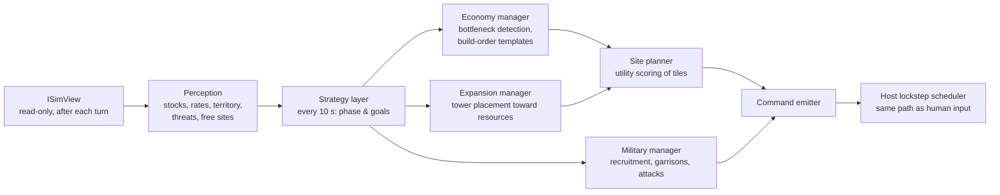
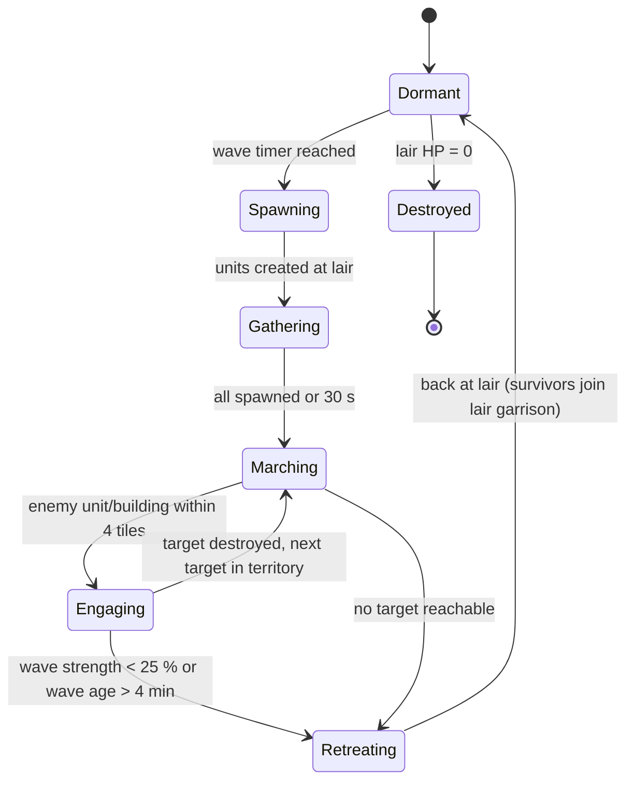

# 05 — AI Players and Monster Behaviour

Related: [01-architecture](01-architecture.md) · [02-networking](02-networking.md) · [04-game-modes](04-game-modes.md) · [06-economy](06-economy.md).

## 1. Two different things
| | AI players (computer opponents/allies) | Monsters |
|---|---|---|
| Code | `Rebuild.Ai` (outside the sim) | `Rebuild.Sim/Systems/Monsters` (inside the sim) |
| Runs on | **host only** | **every peer** (part of deterministic `Step`) |
| Acts via | `Command`s, exactly like a human | direct state changes inside the sim |
| Network traffic | its commands appear in `TurnBundle`s | none |
| Must be deterministic? | Not for sync (clients just replay its commands), **but yes for testing** (see §3) | Yes, strictly |

## 2. AI player architecture

- **Utility-based decisions** (score candidate actions with weighted considerations), a common, tunable approach for strategy AI ([Dave Mark & Kevin Dill, GDC 2010 "Improving AI Decision Modeling Through Utility Theory"](https://www.gdcvault.com/play/1012410/Improving-AI-Decision-Modeling-Through)). Reference for a Settlers-like economy AI: Widelands' `defaultai` (ideas only, GPL — [source tree](https://github.com/widelands/widelands/tree/master/src/ai)).
- **Fair perception**: the AI reads only tiles its team has explored/currently sees (sim `VisibilitySystem`, [04-game-modes §1](04-game-modes.md)); enemy positions outside vision are last-seen memories. No difficulty level ignores fog.
- **Cultures & war (phase D)**: the AI is built after all 4 cultures, the full unit roster and walls exist (roadmap M12), so it handles them from the start: per-culture build-order templates and modifiers come from culture data; army composition uses the counter table of [11-military §3](11-military.md); Hard AI walls off chokepoints near its core and brings siege units when the target has walls.
- **Economy manager**: computes production vs consumption per good over a sliding window (from sim stats); the largest deficit chooses the next building; build-order templates bootstrap the first 10 minutes.
- **Expansion manager**: scores frontier sites by unclaimed resources (wood, stone, ore, fertile land) and distance to threats.
- **Military manager**: estimates own vs enemy strength near the border (soldier count × rank); attacks when ratio exceeds a difficulty-specific threshold; keeps garrisons at border towers; responds to monster waves by reinforcing targeted towers.
- **Stateless takeover**: the AI must be able to start from *any* game state (needed for disconnect takeover, [02-networking §6](02-networking.md)); it rebuilds its plans from perception, never from its own history.

## 3. Determinism & budget of the AI
- AI uses only integers/`Fix`, its own `Pcg32` stream per slot (seeded from match seed + slot), no wall-clock reads. Work is sliced by **work units** (e.g. N site evaluations per turn), **not by elapsed time** — a time-based budget would make results machine-dependent and break reproducible soak tests.
- Same analyzers as the sim apply to `Rebuild.Ai` (see [01-architecture §2](01-architecture.md)).
- Budget: ≤ 2 ms per AI per tick average on the reference machine; 7 AIs ≤ 14 ms, leaving the 100 ms tick comfortable together with the 20 ms sim budget.
- AI commands are generated after turn `T` executes and are sealed into turn `T + D` like human commands — AI has the same input delay as humans (fair).

## 4. Difficulty levels
| Parameter | Easy | Normal | Hard |
|---|---|---|---|
| Strategy re-evaluation | every 30 s | every 15 s | every 5 s |
| Max parallel constructions | 2 | 4 | 6 |
| Site choice | random among top 40 % | best of top 3 | best |
| Attack threshold (own/enemy strength) | ≥ 2.0, first attack ≥ minute 40 | ≥ 1.4 | ≥ 1.15, targets weakest border tower |
| Reaction to attack | none for 60 s | 20 s | immediate reinforcement |
| Tool/weapon planning | fixed quotas | adaptive | adaptive + forward planning |
| Cheats | none | none | none (MVP) |

Acceptance (headless soak, [08-testing](08-testing.md)): Hard beats Normal in ≥ 70 % of 1v1 games, Normal beats Easy in ≥ 80 %; every AI difficulty trains its first soldier before minute 25 on M maps.

## 5. Monster behaviour (deterministic sim system)
Rules (wave schedule, budgets, targeting) are in [04-game-modes §5](04-game-modes.md). Behaviour:

- Target priority when engaging: soldiers > military buildings > civilian buildings > settlers in the open (ties → lowest entity id).
- Movement uses the shared flow-field pathfinding toward the target territory ([06-economy §6](06-economy.md)): one field per wave, cheap for many units.
- All randomness from the `Monsters` RNG stream; all decisions on tick boundaries; iteration in entity-id order.
- Monsters ignore alliances (hostile to all players), never attack each other or neutral ruins.
