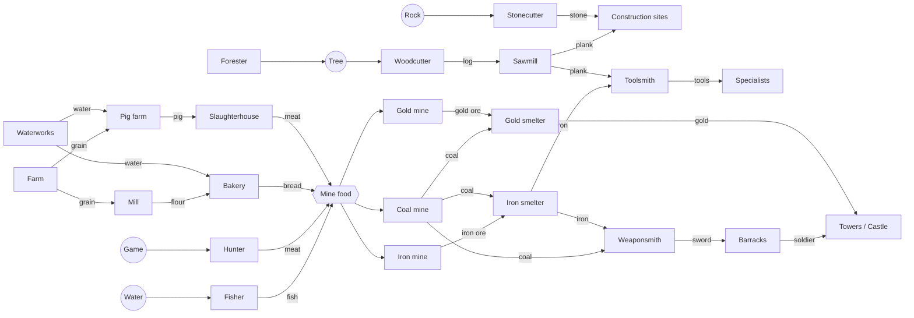
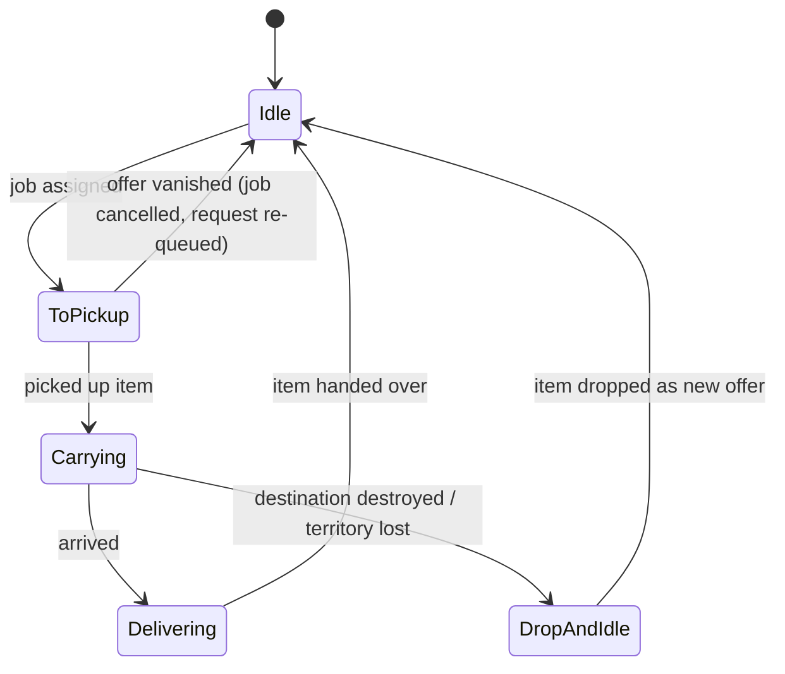

# 06 — Economy, Settlers, Logistics, Military, Pathfinding

Related: [00-vision MVP](00-vision.md) · [01-architecture](01-architecture.md) · [05-ai](05-ai.md). User decisions: free-walking carriers, no roads ([USER-ANSWERS](handoff/USER-ANSWERS.md) Q6); ≤ 8 players, 512² tiles, thousands of settlers (Q8).

Reference for the genre's rules: *The Settlers IV* manual — carriers "automatically go wherever they are needed", carriers stay inside the own territory ([S4 manual, replacementdocs](https://files.replacementdocs.com/The_Settlers_IV_-_Manual_-_PC.pdf)). Values below are ASSUMPTIONS to be tuned in playtests; they live in `data/*.json`, not in code.

## 1. MVP buildings (24)
| Group | Building | Size | Worker (tool) | Inputs → Output | Notes |
|---|---|---|---|---|---|
| Core | Castle | L | — | — | start building; storage; territory r=16; houses soldiers |
| Core | Storehouse | M | — | — | storage hub, reduces carry distances |
| Core | Residence | S | — | → carriers | +1 carrier / 60 s up to +10 per residence |
| Construction | Woodcutter | S | woodcutter (axe) | tree → log | work radius 8 |
| Construction | Forester | S | forester (shovel) | → plants tree | |
| Construction | Sawmill | M | sawyer (saw) | log → plank | |
| Construction | Stonecutter | S | stonecutter (pickaxe) | rock → stone | |
| Food | Fisher | S | fisher (rod) | fish (water) → fish | |
| Food | Hunter | S | hunter (bow) | game → meat | |
| Food | Farm | M | farmer (scythe) | → grain | sows + harvests fields in radius 4 |
| Food | Waterworks | S | water carrier (bucket) | → water | |
| Food | Mill | M | miller | grain → flour | |
| Food | Bakery | M | baker | flour + water → bread | |
| Food | Pig farm | M | pig farmer | grain + water → pig | |
| Food | Slaughterhouse | M | butcher (cleaver) | pig → meat | |
| Mining | Coal mine | S (on mountain) | miner (pickaxe) | 1 food (fish/meat/bread) → coal | depletes deposit |
| Mining | Iron mine | S | miner (pickaxe) | 1 food → iron ore | |
| Mining | Gold mine | S | miner (pickaxe) | 1 food → gold ore | |
| Metal | Iron smelter | M | smelter | iron ore + coal → iron | |
| Metal | Gold smelter | M | smelter | gold ore + coal → gold | |
| Metal | Toolsmith | M | smith (hammer) | iron + plank → tool (by quota) | |
| Metal | Weaponsmith | M | smith (hammer) | iron + coal → sword; iron + plank → spear; plank → bow + arrows | weapon chosen by quota |
| Military | Barracks | M | — | carrier + weapon → soldier (unit type per weapon, [11-military](11-military.md)) | |
| Military | Guard tower small / large | S / M | soldiers 1–3 / 1–6 | gold → rank-up of a garrisoned soldier | territory r=8 / r=12 |

As built (M2 step 2): the table lives in [data/buildings.json](../data/buildings.json) (id, size, placement, territory radius, plank/stone cost — costs are ASSUMPTIONS), compiled into `BuildingCatalog`/`BuildingIds` at build time (`src/Rebuild.Analyzers/BuildingDataGenerator.cs`, error RB0101 on bad data). Footprints are squares, S 2×2, M 3×3, L 4×4 tiles (ASSUMPTION), and keep a 1-tile free margin to every other footprint so buildings never close a passage. `PlaceBuilding(type, x, y, rotation)` (top-left tile; rotation 0–3 is cosmetic) is valid when every footprint tile is in the player's own territory and suits the building (land: buildable tile; mines: walkable mountain tile without objects) — rules in `src/Rebuild.Sim/World/BuildingPlacement.cs`, shared by validation, UI and AI. It creates a construction site; `CancelConstruction(id)` removes an own site. The start castle is placed complete, centred on the start, and owns the r = 16 claim.

## 2. Production chains

As built (M2 step 3): [data/goods.json](../data/goods.json) lists 28 goods — the 18 below plus one good per tool kind (axe, saw, pickaxe, shovel, hammer, scythe, fishing rod, hunting bow, cleaver, bucket) instead of a tool family with sub-types — with each good's start-castle stock (ASSUMPTION: 40 planks, 30 stone, 10 each of fish/meat/bread, a few tools). It is compiled into `GoodCatalog`/`GoodIds` (error RB0102 on bad data); its hash is part of `GameVersion`.

Goods (21 shared): log, plank, stone, fish, meat, grain, flour, water, bread, pig, coal, iron ore, gold ore, iron, gold, sword, spear, bow (arrows abstracted into bow), + culture goods ([10-cultures](10-cultures.md)), + tools (axe, saw, pickaxe, shovel, hammer, scythe, rod, bow, cleaver, bucket → tracked as one "tool" family with sub-type).

## 3. Settlers
| Role | Becomes one by | Behaviour |
|---|---|---|
| Carrier | spawned by castle/residence | executes transport jobs; idle carriers wait near storehouses |
| Builder (hammer) | carrier picks up tool | constructs sites step by step as materials arrive |
| Digger (shovel) | carrier picks up tool | levels the site's terrain before building |
| Specialist | carrier + tool when a finished building needs a worker | bound to its building; walks to resources in work radius |
| Soldier | barracks: carrier + sword | garrisons, attacks, defends |

As built (M2 step 4, `src/Rebuild.Sim/World/Settlers.cs`, runs after construction every tick): carriers are settler entities (id, owner, home building, tile, idle/walking, sub-tile progress, remaining path). `"carriers"` in [data/buildings.json](../data/buildings.json) is how many carriers a complete building keeps (castle 30, residence 10, ASSUMPTION): every 600 ticks (60 s) each such building homing fewer spawns one at its door (the margin tile below the bottom-centre of its footprint, else the first free walkable margin tile; no spawn without one); the start castle starts with all 30. Carriers of a demolished home stay alive and no longer count anywhere (ASSUMPTION). Settlers walk only on walkable tiles of their own territory that no building covers (map objects do not block yet); a settler covered by a newly placed building is put at that building's door; a walker whose next tile becomes blocked stops and plans again 2 s later. Until logistics exists, idle carriers wait 2–6 s (Economy RNG) and then wander to a random tile within 6 tiles of their home's door — a placeholder that exercises pathing and movement.

Population cap: carriers ≤ residence capacity. Initial stock: castle with tools, planks, stone, food, 30 carriers, 10 soldiers (Normal start resources).

## 4. Logistics (S4-style free walking)
No roads. Goods lie at output piles, storehouses or construction sites. Carriers walk freely **inside their own territory** (allied territory: ASSUMPTION allowed, see [04-game-modes](04-game-modes.md)).

**Request/offer matching** (`LogisticsSystem`, every tick, bounded work):
- *Offers*: items in output piles, storehouses (each item has id, good type, location, reserved flag).
- *Requests*: construction sites (exact amounts), production inputs (refill to stock target, default 4), storehouses (absorb overflow from piles).
- Requests processed in deterministic order: `(goodPriority[player], buildingPriority, createdTick, requestId)`. Good priority is player-set ([01-architecture §4](01-architecture.md) `SetTransportPriority`).
- For each request: nearest unreserved offer by **sector distance** (map split into 16×16-tile sectors; ring search outward), then nearest idle carrier to that offer (same sector index). Reserve both; create a `TransportJob`. Max 200 matches per tick (ASSUMPTION; enough for 2 000 jobs/s).
- Ties broken by entity id → deterministic.

Construction: site placed → digger levels terrain → builder works while materials arrive (requests for planks/stone) → building finished → worker request.

As built (M2 step 3, `src/Rebuild.Sim/World/Construction.cs`, runs first in every tick): castle and storehouse (`"storage": true` in buildings.json) hold a stock per good once complete; the start castle starts with the goods' start stock. Until carriers, builders and diggers exist, supply is a placeholder: every 10 ticks (1 s) each construction site takes one unit — all planks first, then stone — straight from its owner's lowest-id storage building that has it; sites are served in id order, so older sites win when stock is short. Each delivered unit allows 20 build ticks (2 s, ASSUMPTION); when the full cost is worked in, the building is complete, a military building adds its territory claim (r from data) and a storehouse gets an empty stock. `CancelConstruction` returns the delivered materials to the owner's lowest-id storage building. `Demolish(id)` (own complete building, not the castle) removes the building, its stock and its claim (tiles fall to older covering claims); nothing is refunded and buildings left outside the territory stay until capture rules exist (M4). All ASSUMPTIONS, to be replaced by logistics requests in the next steps.

Production: building cycles `wait inputs → work (N ticks) → place output in pile`; pile cap 8 → building pauses when full. Mines consume one food per cycle; deposits deplete.

Statistics: per player, per good, ring buffer of production/consumption per minute (used by UI and AI, [05-ai](05-ai.md)).

## 5. Territory & military
- Each military building claims a radius (castle 16, large tower 12, small tower 8 tiles). Ownership per tile; on overlap the older claim keeps the tile (S4/S2 convention). Recomputed incrementally only around changed buildings. As built (M2 step 1, `src/Rebuild.Sim/World/Territory.cs`): disc `dx²+dy² ≤ r²`, claim age = monotonically growing claim id, tiles of a removed claim go to the oldest remaining covering claim; the owner grid is hashed every turn and a save must rebuild to the identical grid.
- Civilian buildings may only be placed in own territory; enemy civilian buildings inside newly captured territory burn down.
- **Combat, units, walls, siege**: see [11-military](11-military.md) and [ADR 0008](decisions/0008-combat-model.md) (the earlier duel-at-building model is superseded). Capture: a building changes owner when its garrison is defeated and an attacking melee unit enters it.
- Rank-up: garrisoned soldier consumes 1 gold → +1 rank (max 3).
- Monsters use the same combat system with their own unit stats ([05-ai §5](05-ai.md)).
- **Cultures** modify costs, yields and add unique buildings/goods ([10-cultures](10-cultures.md)); the tables in §1–2 describe the shared core (= Rivermen baseline).

## 6. Pathfinding & movement at scale
Grid: square tiles, 8-neighbour, octile integer costs 10/14 ([ADR 0006](decisions/0006-sim-core-conventions.md)), terrain cost multipliers (plains 1, forest 1.5, hill 2 — as integers ×10). Settlers **do not collide** with each other (as in the Settlers series) → no local avoidance needed for civilians.

| Need | Algorithm | Why |
|---|---|---|
| Short trips (most carrier jobs, < 32 tiles) | A* on tile grid, octile heuristic, binary heap with deterministic tie-break `(f, h, tileIndex)` | Simple, optimal ([Red Blob — A*](https://www.redblobgames.com/pathfinding/a-star/introduction.html)) |
| Long trips (≥ 32 tiles) | **HPA*** with 16×16 clusters: abstract graph of cluster entrances, local refinement ([Botea, Müller, Schaeffer 2004](https://www.semanticscholar.org/paper/Near-Optimal-Hierarchical-Path-Finding-Botea-M%C3%BCller/b0f0432ba69e4d730b93a75e3d19c8e9d811efac)) — up to 10× faster than A*, within ~1 % of optimal | 512² map = 1 024 clusters |
| Many units → one target (army attack, monster wave) | **Flow field** over the cluster corridor from HPA* ([Emerson, "Crowd Pathfinding and Steering Using Flow Field Tiles", Game AI Pro](http://www.gameaipro.com/GameAIPro/GameAIPro_Chapter23_Crowd_Pathfinding_and_Steering_Using_Flow_Field_Tiles.pdf); [howtorts — flow fields](https://howtorts.github.io/2014/01/04/basic-flow-fields.html)) | one computation for N units |
| Reachability queries (placement, AI, map validation) | Region ids per connected land component + territory ownership | O(1) |

Scaling rules:
- **Path requests are queued** and served in request-id order with a **node-expansion budget per tick** (e.g. 60 000 expansions). A budget counted in nodes (not milliseconds) keeps results identical on every machine.
- Paths must be a pure function of `(grid version, start, goal)`. A **path cache** keyed by `(startCluster, goalCluster)` stores abstract routes; invalidation by per-cluster version counters when buildings/objects change. Cache hits change only speed, never results.
- Blocking changes (new building, tree felled) update only the affected cluster's entrances and intra-cluster edges.
- Movement: entity moves along tile waypoints in sub-tile units (1 tile = 256) at integer speed per tick; diagonal steps take 14/10 longer. Client interpolates.
- As built (M2 step 4, `src/Rebuild.Sim/World/Pathfinder.cs`): plain A* (no HPA* yet) with uniform terrain cost, no corner cutting (a diagonal step needs both orthogonal neighbours passable), the start tile exempt from passability, a 2 048-expansion limit per search and a 60 000-expansion budget per tick shared by all settlers in id order (the rest retry next tick). Movement: 64 sub-tile units per tick (2.5 tiles/s, ASSUMPTION), straight step 256, diagonal 358. Tested against a brute-force Dijkstra on random grids.
- Target: 5 000 settlers, average ≤ 60 new path requests/s, pathfinding ≤ 5 ms per tick average on the reference machine (part of the 20 ms sim budget, [01-architecture §3](01-architecture.md)).

## 7. Out of scope for MVP
Roads (speed bonus), donkeys/trade, ships, magic, more than 4 cultures, wine/beer luxury goods. (Cultures, unit roster, walls and siege are in scope — [10-cultures](10-cultures.md), [11-military](11-military.md).)
