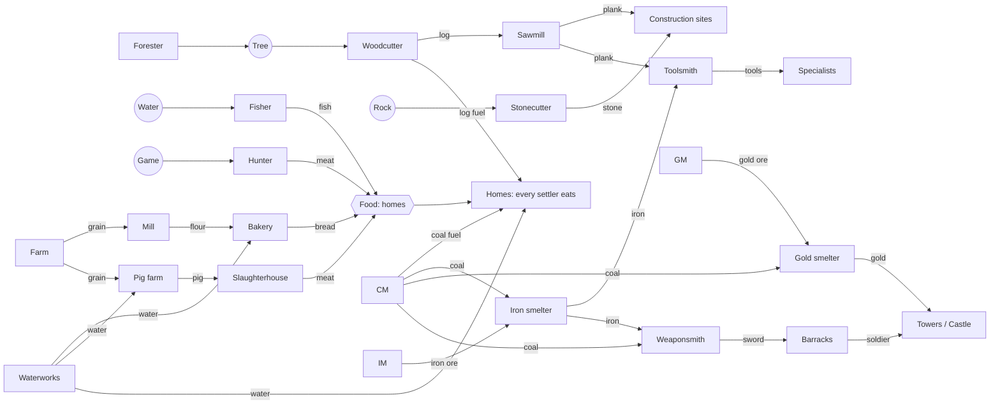
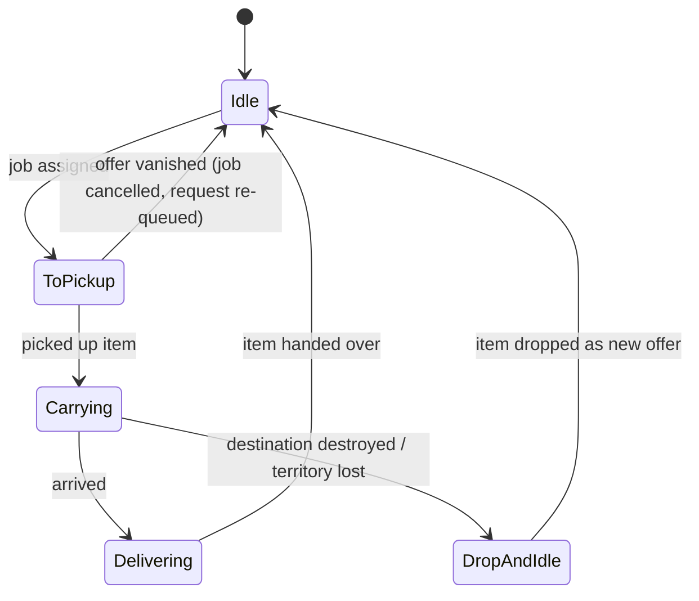

# 06 — Economy, Settlers, Logistics, Military, Pathfinding

Related: [00-vision MVP](00-vision.md) · [01-architecture](01-architecture.md) · [05-ai](05-ai.md). User decisions: free-walking carriers, no roads ([USER-ANSWERS](handoff/USER-ANSWERS.md) Q6); ≤ 8 players, 512² tiles, thousands of settlers (Q8).

Reference for the genre's rules: *The Settlers IV* manual — carriers "automatically go wherever they are needed", carriers stay inside the own territory ([S4 manual, replacementdocs](https://files.replacementdocs.com/The_Settlers_IV_-_Manual_-_PC.pdf)). Values below are ASSUMPTIONS to be tuned in playtests; they live in `data/*.json`, not in code.

## 1. MVP buildings (24)
| Group | Building | Size | Worker (tool) | Inputs → Output | Notes |
|---|---|---|---|---|---|
| Core | Castle | L | — | — | start building; storage; territory r=16; houses soldiers |
| Core | Storehouse | M | — | — | storage hub, reduces carry distances |
| Core | Residence | S | — | → carriers | +1 carrier / 60 s up to +10 per residence; 10 beds; consumes food + water (+ fuel in winter) like every home ([12](12-needs-seasons-weather.md)) |
| Construction | Woodcutter | S | woodcutter (axe) | tree → log | work radius 8 |
| Construction | Forester | S | forester (shovel) | → plants tree | |
| Construction | Sawmill | M | sawyer (saw) | log → plank | |
| Construction | Stonecutter | S | stonecutter (pickaxe) | rock → stone | |
| Food | Fisher | S | fisher (rod) | fish (water) → fish | |
| Food | Hunter | S | hunter (bow) | game → meat | |
| Food | Farm | M | farmer (scythe) | → grain | sows + harvests fields in radius 4 |
| Food | Waterworks | S | water carrier (bucket) | → water | |
| Food | Mill | M | miller | grain → flour | |
| Food | Bakery | M | baker | flour + water → bread | |
| Food | Pig farm | M | pig farmer | grain + water → pig | |
| Food | Slaughterhouse | M | butcher (cleaver) | pig → meat | |
| Mining | Coal mine | S (on mountain) | miner (pickaxe) | → coal (no food, user 2026-10-03) | depletes deposit |
| Mining | Iron mine | S | miner (pickaxe) | → iron ore | |
| Mining | Gold mine | S | miner (pickaxe) | → gold ore | |
| Metal | Iron smelter | M | smelter | iron ore + coal → iron | |
| Metal | Gold smelter | M | smelter | gold ore + coal → gold | |
| Metal | Toolsmith | M | smith (hammer) | iron + plank → tool (by quota) | as built: 9 s, one of 10 tool goods per cycle |
| Metal | Weaponsmith | M | smith (hammer) | iron + coal → sword; iron + plank → spear; plank → bow + arrows | weapon chosen by quota; as built (M2 step 10): iron + coal → sword, spear or bow, 12 s (ASSUMPTION — one input set for all weapons until recipes per output exist) |
| Military | Barracks | M | — | carrier + weapon → soldier (unit type per weapon, [11-military](11-military.md)) | |
| Military | Guard tower small / large | S / M | soldiers 1–3 / 1–6 | gold → rank-up of a garrisoned soldier | territory r=8 / r=12 |

As built (M2 step 2): the table lives in [data/buildings.json](../data/buildings.json) (id, size, placement, territory radius, plank/stone cost — costs are ASSUMPTIONS), compiled into `BuildingCatalog`/`BuildingIds` at build time (`src/Rebuild.Analyzers/BuildingDataGenerator.cs`, error RB0101 on bad data). Footprints are squares, S 2×2, M 3×3, L 4×4 tiles (ASSUMPTION), and keep a 1-tile free margin to every other footprint so buildings never close a passage. `PlaceBuilding(type, x, y, rotation)` (top-left tile; rotation 0–3 is cosmetic) is valid when every footprint tile is in the player's own territory and suits the building (land: buildable tile; mines: walkable mountain tile without objects) — rules in `src/Rebuild.Sim/World/BuildingPlacement.cs`, shared by validation, UI and AI. It creates a construction site; `CancelConstruction(id)` removes an own site. The start castle is placed complete, centred on the start, and owns the r = 16 claim.

## 2. Production chains

As built (M2 step 3): [data/goods.json](../data/goods.json) lists 28 goods — the 18 below plus one good per tool kind (axe, saw, pickaxe, shovel, hammer, scythe, fishing rod, hunting bow, cleaver, bucket) instead of a tool family with sub-types — with each good's start-castle stock (ASSUMPTION: 40 planks, 30 stone, 10 each of fish/meat/bread, a few tools). It is compiled into `GoodCatalog`/`GoodIds` (error RB0102 on bad data); its hash is part of `GameVersion`.

Goods (21 shared): log, plank, stone, fish, meat, grain, flour, water, bread, pig, coal, iron ore, gold ore, iron, gold, sword, spear, bow (arrows abstracted into bow), + culture goods ([10-cultures](10-cultures.md)), + tools (axe, saw, pickaxe, shovel, hammer, scythe, rod, bow, cleaver, bucket → tracked as one "tool" family with sub-type).

## 3. Settlers
| Role | Becomes one by | Behaviour |
|---|---|---|
| Carrier | spawned by castle/residence | executes transport jobs; idle carriers wait near storehouses |
| Builder (hammer) | carrier picks up tool | constructs sites step by step as materials arrive |
| Digger (shovel) | carrier picks up tool | levels the site's terrain before building |
| Specialist | carrier + tool when a finished building needs a worker | bound to its building; walks to resources in work radius |
| Soldier | barracks: carrier + sword | garrisons, attacks, defends |

As built (M2 step 4, `src/Rebuild.Sim/World/Settlers.cs`, runs after construction every tick): carriers are settler entities (id, owner, home building, tile, idle/walking, sub-tile progress, remaining path). `"carriers"` in [data/buildings.json](../data/buildings.json) is how many carriers a complete building keeps (castle 30, residence 10, ASSUMPTION): every 600 ticks (60 s) each such building homing fewer spawns one at its door (the margin tile below the bottom-centre of its footprint, else the first free walkable margin tile; no spawn without one); the start castle starts with all 30. Carriers of a demolished home stay alive and no longer count anywhere (ASSUMPTION). Settlers walk only on walkable tiles of their own territory that no building covers (map objects do not block yet); a settler covered by a newly placed building is put at that building's door; a walker whose next tile becomes blocked stops and plans again 2 s later. Carriers with a transport job carry goods (§4); idle carriers without one wait 2–6 s (Economy RNG) and then wander to a random tile within 6 tiles of their home's door — a placeholder that exercises pathing and movement.

As built (M2 step 12, workers): every production building in [data/buildings.json](../data/buildings.json) names its worker's `"tool"` — woodcutter axe, forester shovel, sawmill saw, stonecutter and the three mines pickaxe, fisher fishing rod, hunter hunting bow, farm scythe, waterworks bucket, slaughterhouse cleaver, toolsmith and weaponsmith hammer; mill, bakery, pig farm and the smelters need none (`ProductionDefinition.Tool`, `NoTool`). A complete production building only starts cycles while its worker is inside. `Logistics.Match` serves worker requests before all transport requests, buildings in id order: a building without a worker (inside or on the way) gets the owner's storage nearest to it (sector distance) that holds the tool and the idle carrier nearest to that storage; without a tool in any storage the building waits (a toolsmith has to make one); a building without a tool gets the idle carrier nearest to itself. Such a worker job is a `TransportJob` of kind `Employ`: the tool leaves the stock at once, the carrier walks to the storage door, picks it up, walks to the building's door and becomes its worker (`SettlerKind.Worker`, `HomeId` = the building), who keeps the tool (not counted as consumed). A tool-less job starts in `Carrying` with the building as source. If the building vanishes or cannot be reached before the hand-over, a fetched tool goes to the nearest storage like any carried unit and an unpicked one back to its stock; the building can request a new worker. Workers stay inside (standing at the door, ASSUMPTION — they do not walk to trees or fish yet) and keep no carrier count anywhere, so the castle or residence that spawned the carrier refills it (1 per 60 s). When its workplace is demolished, the worker comes out as a carrier that no building homes (ASSUMPTION) and carries its tool to the owner's nearest storage (a transport job from the demolished building; user, 2026-10-03: the tool must not be lost) — lost only if the owner has no storage left. Save format 11 (job kind; load checks worker jobs, at most one worker inside or on the way per building, workers only in live complete production buildings and a running cycle only with its worker inside); `GameVersion` 0.14.0, 0.15.0 with the tool return. Builders and diggers (construction workers with hammer and shovel) are still to come.

**Needs (user, 2026-10-03; [12-needs-seasons-weather](12-needs-seasons-weather.md), [ADR 0009](decisions/0009-needs-seasons-weather.md) proposed):** every settler — not only miners — has a home bed and needs food and water; every building burns a little log or coal in winter; shortages slow work, stop spawning and finally make settlers leave; amounts differ per culture. Population cap: sum of beds (supersedes "carriers ≤ residence capacity"). Initial stock: castle with tools, planks, stone, food, 30 carriers, 10 soldiers (Normal start resources).

## 4. Logistics (S4-style free walking)
No roads. Goods lie at output piles, storehouses or construction sites. Carriers walk freely **inside their own territory** (allied territory: ASSUMPTION allowed, see [04-game-modes](04-game-modes.md)).

**Request/offer matching** (`LogisticsSystem`, every tick, bounded work):
- *Offers*: items in output piles, storehouses (each item has id, good type, location, reserved flag).
- *Requests*: construction sites (exact amounts), production inputs (refill to stock target, default 4), storehouses (absorb overflow from piles).
- Requests processed in deterministic order: `(goodPriority[player], buildingPriority, createdTick, requestId)`. Good priority is player-set ([01-architecture §4](01-architecture.md) `SetTransportPriority`).
- For each request: nearest unreserved offer by **sector distance** (map split into 16×16-tile sectors; ring search outward), then nearest idle carrier to that offer (same sector index). Reserve both; create a `TransportJob`. Max 200 matches per tick (ASSUMPTION; enough for 2 000 jobs/s).
- Ties broken by entity id → deterministic.

As built (M2 step 5, `src/Rebuild.Sim/World/Logistics.cs`, matching runs every tick between construction and movement): a first pass for construction materials only. *Requests* = each construction site's missing planks and stone (cost − delivered − units already on the way); *offers* = the stocks of the owner's complete storage buildings (castle, storehouse). Sites are served in id order (older first), planks before stone; for each missing unit the storage holding the good that is nearest by sector distance (16×16-tile sectors, Chebyshev distance between the sectors of the building centres; ties: lower id) and then the idle carrier (no job, standing) nearest to that storage (same metric; ties: lower id) form a `TransportJob` (id, owner, carrier, good, source, destination, `ToPickup`/`Carrying`); ≤ 200 jobs per tick. The matched unit leaves the source stock at once (reservation). The carrier walks to the source door, picks the unit up, walks to the destination door and hands it over (site: delivered count + 1; storage: stock + 1). Job path searches may expand 16 384 nodes (ASSUMPTION until HPA*) from the same 60 000-per-tick budget. Failure handling (ASSUMPTIONS until ground piles exist): a pickup whose destination vanished, or whose source cannot be reached, returns the unit to the source stock or output pile; a carried unit whose destination vanished or cannot be reached goes to the owner's nearest storage not marked unreachable instead, and is lost when no such storage is left (since M2 step 6); a building a carrier failed to reach is left out of matching for 30 s, so an unreachable site does not keep carriers busy. Idle carriers without a job still wander near their home. Production inputs, output offers and overflow were added in M2 step 6 (below); player transport priorities come later.

Construction: site placed → digger levels terrain → builder works while materials arrive (requests for planks/stone) → building finished → worker request.

As built (M2 step 3, `src/Rebuild.Sim/World/Construction.cs`, runs first in every tick): castle and storehouse (`"storage"` in buildings.json; a capacity since M2 step 14) hold a stock per good once complete; the start castle starts with the goods' start stock. Since M2 step 5 carriers deliver the materials (see above; the step-3 placeholder of 1 unit/site/s straight from storage, planks strictly before stone, is gone); builders and diggers do not exist yet. Each delivered unit allows 20 build ticks (2 s, ASSUMPTION); when the full cost is worked in, the building is complete, a military building adds its territory claim (r from data) and a storehouse gets an empty stock. `CancelConstruction` returns the delivered materials to the owner's lowest-id storage building. `Demolish(id)` (own complete building, not the castle) removes the building, its stock and its claim (tiles fall to older covering claims); nothing is refunded and buildings left outside the territory stay until capture rules exist (M4). All ASSUMPTIONS, to be replaced by logistics requests in the next steps.

Production: building cycles `wait inputs → work (N ticks) → place output in pile`; pile cap 8 → building pauses when full. Mines need no food of their own (user 2026-10-03; their miners eat at home like every settler, [12 §1](12-needs-seasons-weather.md)); deposits deplete. Production goes on until the output pile is full; the pile only stays full when no reachable storage has room (storage capacity, M2 step 14). Seasons change yields (no farm output in winter, harvest +25 % in autumn, fisher −50 % in winter, [12 §2](12-needs-seasons-weather.md); built in M2 step 13 as a per-season work speed in `data/buildings.json`).

As built (M2 step 6, `src/Rebuild.Sim/World/Production.cs`, runs every tick after construction and before logistics matching): `"production"` in [data/buildings.json](../data/buildings.json) gives a building optional inputs (`{good: amount}`, at most 2), an optional harvest (`tree`/`stone` object within `radius` tiles of the building centre on own territory), one output good and the cycle length in ticks — so far woodcutter (tree → log, r = 8, 15 s), sawmill (1 log → 1 plank, 6 s) and stonecutter (stone → stone, r = 8, 15 s), all ASSUMPTIONS. A complete production building owns one input pile per input and an output pile. A cycle starts when every input pile holds its amount (taken at the start), a harvest object is in reach, and the output pile has room (output pile + units reserved from it + this cycle's unit ≤ 8); after the cycle the nearest harvest object (squared distance, ties: lower tile index) loses one unit — a tree disappears, a stone outcrop loses one unit of its amount and disappears with the last — and one unit goes into the output pile (nothing if the object went meanwhile and none is left). Workers do not exist yet: a complete building works on its own (ASSUMPTION until specialists). Harvested tiles are a new sim-state layer (`World/MapChanges`: tile, object, amount; applied to the regenerated map on load; a freed tile becomes buildable). Logistics (§4) now serves three request kinds per tick, each pass over the buildings in id order: site materials, production inputs (refill each input pile to 4 counting units on the way) and overflow (every unit left in an output pile goes to the nearest storage). Offers are storage stocks and output piles; a request takes the nearest offer by sector distance other than the requester itself. Forester (planting), mines with depletion, smiths with quotas, tools as worker requirements and production statistics follow in the next steps.

As built (M2 step 7): the harvest becomes a `HarvestSource` (`src/Rebuild.Sim/Buildings/BuildingDefinition.cs`) — `tree`, `stone`, `game` (map objects) and `fish` (the fish resource on water tiles, `MapData.Amount` units per tile) are *consumed*: the nearest one in reach loses one unit per cycle (a tree or game animal disappears, stone and fish lose one unit of their amount and go with the last); `water` and `fertile` are terrain that only has to lie in reach on own territory and is never used up. New production data (ASSUMPTIONS): fisher (fish, r = 6, 15 s), hunter (game, r = 10, 20 s), farm (fertile land within r = 4, 30 s — fields are abstracted until sowing/harvesting exists), waterworks (water within r = 4, 9 s), mill (1 grain → 1 flour, 9 s), bakery (1 flour + 1 water → 1 bread, 9 s), pig farm (1 grain + 1 water → 1 pig, 20 s), slaughterhouse (1 pig → 1 meat, 9 s), iron smelter (1 iron ore + 1 coal → 1 iron, 12 s), gold smelter (1 gold ore + 1 coal → 1 gold, 12 s). Game and fish do not regrow yet (ASSUMPTION). `World/MapChanges` now records tile, object, resource and amount (save format 8); load accepts a change only if it is something `Take` can leave behind (object gone or stone reduced with the resource untouched, or — on a tile without object — fish gone or reduced). Mines still produce nothing: they need alternative food inputs and ore deposits (next step).

As built (M2 step 8): the three mines (S, on mountain) now produce. Their production has one input pile that accepts any of several goods — written `"fish|meat|bread": 1` in [data/buildings.json](../data/buildings.json) and exposed as `ProductionDefinition.Alternatives` — so a cycle eats one food of any kind. Logistics refills the food pile to 4 like any input pile; for a pile with alternatives it takes the nearest offer of any of its goods, and a storage hands out the food it holds most of (ties: data order fish, meat, bread). The harvest sources `coal`, `iron_ore` and `gold_ore` are ore deposits (the map resource on a mountain tile without object): the deposit tile nearest the mine centre within r = 3 (covers the footprint and its margin) loses one unit of its amount per cycle and the resource disappears with the last unit; a mine with no deposit left in reach idles with its food waiting in the pile (ASSUMPTION — no Settlers-style residual yield yet). Cycle lengths (ASSUMPTIONS): coal and iron 15 s, gold 20 s. `World/MapChanges` accepts dug-out or reduced deposits on load; the save layout is unchanged. Forester planting, toolsmith/weaponsmith with quotas and production statistics follow. *(Superseded in M2 step 14: mines eat no food.)*

As built (M2 step 9): the forester plants trees. Its production in [data/buildings.json](../data/buildings.json) is `{ "plant": "tree", "radius": 6, "ticks": 120 }` — no inputs, no output good (`ProductionDefinition.Plant` = `Tree`, `Output` = `NoOutput`; the generator rejects `plant` together with `output` or `harvest`, or without `radius`). A cycle starts when a free tile lies within r = 6 of the centre on own territory and, after 12 s, plants a tree (amount 0) on the nearest free tile (squared distance, ties: lower tile index); if none is left the cycle yields nothing and the forester idles. A free tile is buildable land (plains or fertile, flat enough, no object) without resource, is no building footprint tile and does not touch one (margin and doors stay clear), and has no tree among its 8 neighbours, so planted trees never form solid forest (ASSUMPTIONS: radius, cycle, spacing; trees are full-grown at once until growth stages exist). Trees do not block walking but make the tile unbuildable. Planted tiles are map changes; on load a tree or nothing (amount 0) is accepted on a tile without resource that is buildable once cleared and whose generated object was none, tree, stone or game; a forester's output pile must be empty. Woodcutters fell planted trees like generated ones. Save layout unchanged (format 8); `GameVersion` 0.11.0. Toolsmith/weaponsmith with quotas and production statistics follow.

As built (M2 step 10): toolsmith and weaponsmith produce. A production may list `"outputs"` instead of `"output"` in [data/buildings.json](../data/buildings.json) — toolsmith `{ "inputs": { "iron": 1, "plank": 1 }, "outputs": [axe, saw, pickaxe, shovel, hammer, scythe, fishing_rod, hunting_bow, cleaver, bucket], "ticks": 90 }`, weaponsmith `{ "inputs": { "iron": 1, "coal": 1 }, "outputs": [sword, spear, bow], "ticks": 120 }` (ASSUMPTIONS; the generator rejects `outputs` with fewer than 2 or more than 16 goods, duplicates, or together with `output`/`plant`). Such a building has one output pile per output good (`ProductionDefinition.Outputs`, `HasChoice`); the cap of 8 applies to all its output piles together, and overflow carries each pile's good to storage. Which good a cycle makes is the owner's choice: `World/ProductionQuotas` keeps, per player, a weight 0..10 for every good that is some building's output choice (default 1 = equal shares, ASSUMPTION) and a credit per good. The new command `SetToolProductionQuota` (payload u16 good, u8 weight; rejected for goods without quota, weights > 10 and wrong payloads) sets a weight for tools and weapons alike and resets that player's credits. When every other start condition holds, the cycle picks its output by smooth weighted round robin among the outputs with weight > 0 (each credit grows by its weight, the largest credit wins — ties: data order — and loses the total weight), so each good gets its weight's share of cycles, evenly interleaved; with every weight 0 the smith idles with its inputs waiting. The running cycle keeps its pick in `Building.Choice`. Save format 9 (`Choice` per building, weights and credits per player; load checks weights ≤ 10, credit 0 at weight 0, credits in range and balanced per smith); `GameVersion` 0.12.0. Production statistics follow.

Statistics: per player, per good, ring buffer of production/consumption per minute (consumption includes household food, water and fuel) (used by UI and AI, [05-ai](05-ai.md)).

As built (M2 step 11, `src/Rebuild.Sim/World/ProductionStatistics.cs`): per player and good, the units produced and consumed in each game minute (600 ticks) are kept in a ring buffer of the last 60 minutes (ASSUMPTION: one hour of history), plus match totals (64-bit). A unit is *produced* when a production cycle puts it into an output pile; it is *consumed* when a carrier hands it over to an input pile of a production building or to a construction site (ASSUMPTION: counted at hand-over rather than at cycle start, because an input pile with alternatives (`"a|b|c"` in data) does not remember which good it holds; refunds of a cancelled site and units lost with a demolished building are not counted). Minute m lives in slot m mod 60; the slot of a minute is cleared right after the tick that starts it, so a minute's counts are complete once the next minute runs. Queries: `Produced`/`Consumed(player, good, minutesAgo)` (0 = running minute, 0 outside the buffer or before match start) and `TotalProduced`/`TotalConsumed`. The statistics are sim state (the AI will read them): hashed every turn and saved (format 10) — only the slots in use (min(minute + 1, 60)) are written, the running minute follows from the tick; load rejects negative counts, totals below their per-minute counts and a negative tick. `GameVersion` 0.13.0. Household food, water and fuel join the consumption with needs ([12](12-needs-seasons-weather.md)).

As built (M2 step 14, user requests 2026-10-03): **mines without food** — the `"fish|meat|bread"` input is gone from the three mines, so a mine only needs its miner (pickaxe) and a deposit in reach; the alternative-goods input pile (`"a|b|c"`, `ProductionDefinition.Alternatives`) stays in the code for the planned home fuel pile ([12 §2](12-needs-seasons-weather.md)) but no building uses it now. **Storage capacity** — `"storage"` in [data/buildings.json](../data/buildings.json) is now a capacity in units of all goods together (castle 500, storehouse 300; ASSUMPTIONS; generator RB0101 accepts 1..100 000; `BuildingDefinition.StorageCapacity`, `IsStorage` = capacity > 0). Overflow matching (`Logistics.Match`, pass 3) sends an output unit only to the owner's nearest reachable storage with room = capacity − stock − units already on the way there (computed once per tick when the overflow pass needs it, so units taken out earlier in the tick free room). With no such storage the units stay in the output pile, which fills to 8, and the building pauses until room appears again — so every production building produces until its own pile is full **and** no reachable storage has room. Units returned to a storage (refunds of a cancelled site, tools of freed workers, carried units whose destination vanished) ignore the capacity and may exceed it (ASSUMPTION: goods are never lost to a full storage). No new sim state: save format unchanged (12); `GameVersion` 0.17.0; the `m2-build` golden replay was regenerated.

## 5. Territory & military
- Each military building claims a radius (castle 16, large tower 12, small tower 8 tiles). Ownership per tile; on overlap the older claim keeps the tile (S4/S2 convention). Recomputed incrementally only around changed buildings. As built (M2 step 1, `src/Rebuild.Sim/World/Territory.cs`): disc `dx²+dy² ≤ r²`, claim age = monotonically growing claim id, tiles of a removed claim go to the oldest remaining covering claim; the owner grid is hashed every turn and a save must rebuild to the identical grid.
- Civilian buildings may only be placed in own territory; enemy civilian buildings inside newly captured territory burn down.
- **Combat, units, walls, siege**: see [11-military](11-military.md) and [ADR 0008](decisions/0008-combat-model.md) (the earlier duel-at-building model is superseded). Capture: a building changes owner when its garrison is defeated and an attacking melee unit enters it.
- Rank-up: garrisoned soldier consumes 1 gold → +1 rank (max 3).
- Monsters use the same combat system with their own unit stats ([05-ai §5](05-ai.md)).
- **Cultures** modify costs, yields and add unique buildings/goods ([10-cultures](10-cultures.md)); the tables in §1–2 describe the shared core (= Rivermen baseline).

## 6. Pathfinding & movement at scale
Grid: square tiles, 8-neighbour, octile integer costs 10/14 ([ADR 0006](decisions/0006-sim-core-conventions.md)), terrain cost multipliers (plains 1, forest 1.5, hill 2 — as integers ×10). Settlers **do not collide** with each other (as in the Settlers series) → no local avoidance needed for civilians.

| Need | Algorithm | Why |
|---|---|---|
| Short trips (most carrier jobs, < 32 tiles) | A* on tile grid, octile heuristic, binary heap with deterministic tie-break `(f, h, tileIndex)` | Simple, optimal ([Red Blob — A*](https://www.redblobgames.com/pathfinding/a-star/introduction.html)) |
| Long trips (≥ 32 tiles) | **HPA*** with 16×16 clusters: abstract graph of cluster entrances, local refinement ([Botea, Müller, Schaeffer 2004](https://www.semanticscholar.org/paper/Near-Optimal-Hierarchical-Path-Finding-Botea-M%C3%BCller/b0f0432ba69e4d730b93a75e3d19c8e9d811efac)) — up to 10× faster than A*, within ~1 % of optimal | 512² map = 1 024 clusters |
| Many units → one target (army attack, monster wave) | **Flow field** over the cluster corridor from HPA* ([Emerson, "Crowd Pathfinding and Steering Using Flow Field Tiles", Game AI Pro](http://www.gameaipro.com/GameAIPro/GameAIPro_Chapter23_Crowd_Pathfinding_and_Steering_Using_Flow_Field_Tiles.pdf); [howtorts — flow fields](https://howtorts.github.io/2014/01/04/basic-flow-fields.html)) | one computation for N units |
| Reachability queries (placement, AI, map validation) | Region ids per connected land component + territory ownership | O(1) |

Scaling rules:
- **Path requests are queued** and served in request-id order with a **node-expansion budget per tick** (e.g. 60 000 expansions). A budget counted in nodes (not milliseconds) keeps results identical on every machine.
- Paths must be a pure function of `(grid version, start, goal)`. A **path cache** keyed by `(startCluster, goalCluster)` stores abstract routes; invalidation by per-cluster version counters when buildings/objects change. Cache hits change only speed, never results.
- Blocking changes (new building, tree felled) update only the affected cluster's entrances and intra-cluster edges.
- Movement: entity moves along tile waypoints in sub-tile units (1 tile = 256) at integer speed per tick; diagonal steps take 14/10 longer. Client interpolates.
- As built (M2 step 4, `src/Rebuild.Sim/World/Pathfinder.cs`): plain A* (no HPA* yet) with uniform terrain cost, no corner cutting (a diagonal step needs both orthogonal neighbours passable), the start tile exempt from passability, a 2 048-expansion limit per search and a 60 000-expansion budget per tick shared by all settlers in id order (the rest retry next tick). Movement: 64 sub-tile units per tick (2.5 tiles/s, ASSUMPTION), straight step 256, diagonal 358. Tested against a brute-force Dijkstra on random grids.
- Target: 5 000 settlers, average ≤ 60 new path requests/s, pathfinding ≤ 5 ms per tick average on the reference machine (part of the 20 ms sim budget, [01-architecture §3](01-architecture.md)).

## 7. Out of scope for MVP
Roads (speed bonus), donkeys/trade, ships, magic, more than 4 cultures, wine/beer luxury goods. (Cultures, unit roster, walls and siege are in scope — [10-cultures](10-cultures.md), [11-military](11-military.md).)
