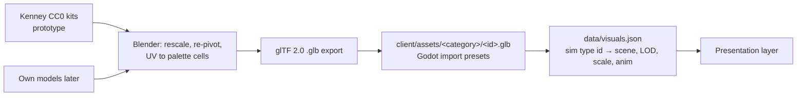

# 07 — Art Style & Asset Pipeline

Decision: low-poly 3D ([ADR 0005](decisions/0005-rendering-2d-vs-3d.md), user preference in [USER-ANSWERS](handoff/USER-ANSWERS.md) Q5). Brief: timeless, simple, small fixed palette, clear silhouettes, swappable; Kenney CC0 for prototyping ([ORIGINAL-BRIEF §2](handoff/ORIGINAL-BRIEF.md)).

## 1. Perspective & camera
| Aspect | Choice |
|---|---|
| Projection | Perspective, narrow FOV (30°) → near-isometric read with depth cues |
| Pitch | fixed ~50°, zoom changes distance (and slightly pitch at max zoom) |
| Rotation | 90° steps (Q/E), animated; free rotation off by default |
| Zoom range | ~8 tiles (close) to ~120 tiles (overview) wide on screen |
| Overview | minimap + strategic zoom: beyond a threshold units become colored dots (MultiMesh of quads) |

## 2. Visual rules
- **Flat shading**, no textures except one shared **palette texture** (16×16 px atlas of flat color cells). Models UV-map faces to palette cells → recolor entire game by swapping one PNG. Kenney 3D kits already use a shared colormap texture, so this matches the prototype assets.
- **Silhouette first**: every building type must be identifiable from its black silhouette at overview zoom; checked by a silhouette test sheet per building.
- **Team color**: per-instance custom data on MultiMesh drives a shader that replaces one reserved palette cell (flags, roofs trim, soldier tabards).
- Lighting: one directional sun + ambient; soft shadows only for buildings (units without shadows at far zoom for performance).
- Height: terrain mesh with vertex colors by terrain type; water as a flat animated plane.

## 3. Palette (initial, swappable)
| Role | Hex | Role | Hex |
|---|---|---|---|
| Grass light | `#8DB255` | Stone | `#A39E93` |
| Grass dark | `#5E8C3A` | Rock/mountain | `#6E6A64` |
| Forest | `#2F5D34` | Snow | `#EDEDE6` |
| Sand | `#D9C38A` | Wood light | `#B8874F` |
| Soil | `#8A6A44` | Wood dark | `#6B4A2B` |
| Water shallow | `#5FA8C9` | Roof | `#A5463A` |
| Water deep | `#2E6F9E` | Plaster | `#E6DCC5` |
| Shadow/outline | `#2A2A2E` | Reserved: team color | (per team) |

Team colors (8, chosen for distinct hue + lightness; verify with a color-blindness simulator before release): `#D64545` red, `#3D6FD6` blue, `#E0B43A` yellow, `#3FA36B` green, `#8C4FD1` purple, `#E07A2F` orange, `#36B5B5` teal, `#E6E6E6` white. Monsters: `#3B2F3F` dark violet.

## 4. Resolution & performance targets
| Item | Target |
|---|---|
| Output | 1280×720 minimum, 1920×1080 target, 4K supported; UI scales with DPI |
| Frame rate | 60 FPS at 1080p on the reference machine (developer's Apple Silicon Mac); Windows/Linux GPU targets (GTX 1060 class) verified once test hardware exists ([open-questions](open-questions.md) E6) with 5 000 settlers on screen budget-capped; 30 FPS minimum on integrated GPUs |
| Settler mesh | ≤ 300 triangles, 2–4 animation states (idle, walk, carry, work) |
| Building mesh | ≤ 1 500 triangles; construction stages = 3 meshes (foundation, frame, done) |
| Tree / rock | ≤ 150 triangles, 3–4 variants each |
| Draw strategy | `MultiMeshInstance3D` per mesh type & LOD ([Godot MultiMesh](https://docs.godotengine.org/en/stable/classes/class_multimesh.html)); terrain in 32×32-tile chunks; no per-entity nodes |
| Animation | Vertex-animation textures or very simple skeletal rigs; MultiMesh-compatible animation via per-instance custom data (animation phase) |

## 5. Asset pipeline

- Godot imports glTF 2.0 natively ([Godot — importing 3D scenes](https://docs.godotengine.org/en/stable/tutorials/assets_pipeline/importing_3d_scenes/index.html)).
- **Swappability**: the sim knows only type ids; `data/visuals.json` maps ids to assets. A new art set = new folder + new mapping file, no code changes.
- Conventions: 1 tile = 1 m; Y-up; origin at footprint center on the ground; building footprint fits its tile size (S 2×2, M 3×3, L 4×4 tiles — ASSUMPTION); file names `snake_case`, ids identical to `data/*.json`.
- Licensing: record source + license of every asset in `client/assets/CREDITS.md` (CC0 needs no attribution, but provenance must be clear before Steam release).

## 6. Prototype asset sources (all CC0)
| Need | Kenney kit |
|---|---|
| Buildings | [Fantasy Town Kit](https://kenney.nl/assets/fantasy-town-kit), [Castle Kit](https://kenney.nl/assets/castle-kit), [Retro Medieval Kit](https://kenney-assets.itch.io/retro-medieval-kit) |
| Trees, rocks, terrain props | [Nature Kit](https://kenney.nl/assets/nature-kit) |
| Settlers, soldiers, monsters | [Mini Characters](https://kenney.nl/assets/mini-characters) (placeholder), recolored via palette |
| UI | Kenney UI packs ([kenney.nl/assets](https://kenney.nl/assets)) |

Gaps (no Kenney equivalent; use primitive placeholders): mines entrance, smelters, specific tool icons → listed in [open-questions](open-questions.md) under art.
