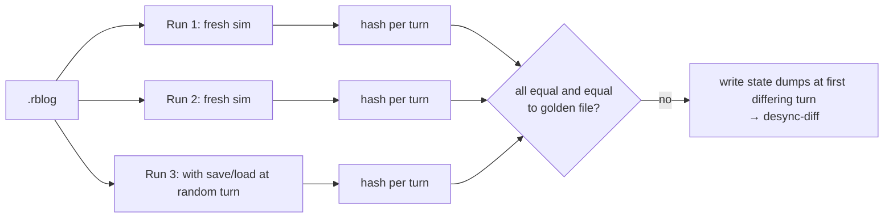

# 08 — Testing Strategy

Related: [01-architecture](01-architecture.md) · [02-networking §4 desync](02-networking.md) · [03-mapgen §8](03-mapgen.md) · [ADR 0006](decisions/0006-sim-core-conventions.md).

## 1. Goals
1. **Determinism**: same inputs ⇒ same state hash, on every supported OS/CPU, every build configuration.
2. **Regression safety** for a solo developer: CI catches desync-causing changes before they ship.
3. Fast feedback: sim tests run with `dotnet test` without Godot ([ADR 0001](decisions/0001-language.md)).

## 2. Test layers
| Layer | Scope | Tooling | When |
|---|---|---|---|
| Static guards | banned float/thread/unordered APIs in Sim, Ai | [BannedApiAnalyzers](https://github.com/dotnet/roslyn-analyzers/blob/main/src/Microsoft.CodeAnalysis.BannedApiAnalyzers/BannedApiAnalyzers.Help.md) + `Rebuild.Analyzers` (warnings = errors) | every build |
| Unit | `Fix`, `Pcg32`, integer noise, A*/HPA*, logistics matching, combat | xUnit | every push |
| Property | `Fix` vs `BigInteger` oracle; serialization round-trip; HPA* path length ≤ 1.01 × A*; mapgen validation after retries | [FsCheck](https://github.com/fscheck/FsCheck) (xUnit integration) | every push (100 cases), nightly (10 000) |
| **Golden map hashes** | `MapSpec → MapHash`, ~24 cases | `tests/golden/mapgen.json` | every push, all OS |
| **Determinism (in-process)** | run a command log twice from scratch → identical per-turn hash sequence | `Rebuild.Tools replay` | every push |
| **Save/load equivalence** | run N turns → save → load → run M turns; hash must equal an uninterrupted N+M run | xUnit | every push |
| **Golden replays** | checked-in command logs + expected per-100-turn hashes | `tests/golden/replays/*.rblog` | every push, all OS |
| Network | lockstep over `LoopbackTransport` with latency/jitter/loss/disconnect injection; all peers' hashes equal | xUnit | every push |
| AI soak | headless AI-vs-AI matches; win-rate and "no stuck economy" metrics ([05-ai §4](05-ai.md)) | `Rebuild.Tools soak` | nightly |
| Performance | sim tick time at 8 players/5 000 settlers; mapgen time ([03-mapgen §7](03-mapgen.md)) | BenchmarkDotNet + soak telemetry | nightly, trend tracked |
| Client smoke | Godot headless boot, load map, run 600 ticks, exit 0 | Godot `--headless` | every push (Linux), nightly (all) |
| Manual | LAN + Steam sessions across Win/macOS/Linux. The user owns only an Apple Silicon Mac: macOS is tested locally; Windows/Linux determinism is covered by CI; real Windows/Linux play sessions need extra hardware, cloud VMs or playtesters ([open-questions](open-questions.md) E6) | checklist in roadmap milestones | per milestone |

## 3. Determinism tests in detail
**Command log format (`.rblog`)**: header `{GameVersion, MapSpec, SlotTable, matchSeed}` + stream of `TurnBundle`s. The same format is written by every real match (host side) → any played game becomes a regression test.

- On mismatch the test writes text dumps at the first differing turn and runs `desync-diff`, which prints the first differing entity/field ([02-networking §4](02-networking.md); approach used by Widelands syncstreams and *Realms of Ruin* ([GDC 2024 Pollard](https://media.gdcvault.com/gdc2024/Slides/GDC+slide+presentations/Pollard_Bradley_CrossPlatformDeterminism+2024-03-26+09.34.19.pdf))).
- **Build-config matrix**: Debug and Release must produce the same hashes (catches optimizer-dependent behaviour; [Gaffer — Floating Point Determinism](https://gafferongames.com/post/floating_point_determinism/) documents debug/release divergence for floats).
- **Golden updates** are allowed only together with a `GameVersion`/`GeneratorVersion` bump in the same commit; CI rejects golden changes without a version bump.

## 4. Cross-platform CI (GitHub Actions)
| Runner | Arch | Purpose |
|---|---|---|
| `ubuntu-latest` | x64 | full suite, Godot headless client smoke, exports |
| `windows-latest` | x64 | full suite |
| `macos-latest` (Apple Silicon) | arm64 | full suite |
| `macos-15-intel` | x64 | golden hashes + replays (Intel macOS). GitHub supports Intel macOS runners only until ~Aug 2027 ([GitHub changelog](https://github.blog/changelog/2025-09-19-github-actions-macos-13-runner-image-is-closing-down/)); afterwards run x64 tests under Rosetta 2 on arm64 runners. |

- Godot + .NET setup via [chickensoft-games/setup-godot](https://github.com/chickensoft-games/setup-godot).
- Cross-OS hash equality: every job uploads `hashes.json` (golden map hashes + replay hash sequences); a final job downloads all and asserts byte equality across the four runners.
- Nightly: property tests (10 000 cases), mapgen 1 000-seed sweep per size, AI soak (e.g. 40 matches), performance benchmarks, exports for all three OS.

## 5. Replay tests
- Every milestone adds at least one long golden replay (≥ 30 min game time, multiple players, AI, monsters).
- Replays from manual playtests that revealed bugs are trimmed and checked in.
- Replay compatibility is **per `GameVersion` only**; older replays are re-recorded (by re-running with AI/scripted inputs) or retired when the version bumps.

## 6. Acceptance gates (definition of done for sim changes)
- All analyzers clean; unit/property/golden/replay tests green on all four runners.
- Cross-OS hash comparison job green.
- Tick-time benchmark not regressed by > 10 % without a note in the PR.
