# 09 — Roadmap

**Capacity basis:** solo developer, part-time, ~12 h/week ([USER-ANSWERS](handoff/USER-ANSWERS.md) Q1). Effort is given in **weeks at 12 h/week** (1 w ≈ 12 h). Estimates are rough (±40 %); AI-agent assistance is assumed but not counted as extra capacity.

**Gates**
- ADRs 0001–0008 approved 2026-10-02.
- Spikes are **not permitted yet** (user: "No spikes yet" and again "Not yet", 2026-10-02) — ask again before S1.

**Priority (user, 2026-10-02):** "first of all its important to have a working version with lan support, after that comes steam and so on". The first LAN build has **1 culture, 2–3 warrior types, no walls**. After the LAN Alpha come **cultures & war first, then Steam** (user, 2026-10-02: "Cultures & walls first"). Linux: CI from day one, shipped in phase E. Scope accepted; cuts to be reconsidered after the LAN Alpha.

## 1. Phases & dependencies

```mermaid
flowchart LR
  subgraph A["Phase A — LAN Alpha"]
    S[Spikes S1–S5] --> M0[M0 Foundations]
    M0 --> M1[M1 Map gen]
    M0 --> M2[M2 Sim economy]
    M1 --> M2
    M2 --> M3[M3 Godot client]
    M2 --> M4[M4 Military core<br/>direct control, 3 units, fog]
    M3 --> M5[M5 LAN multiplayer<br/>= LAN Alpha]
    M4 --> M5
  end
  subgraph B["Phase B — Cultures & war"]
    M6[M6 Fortifications] --> M7[M7 Siege & base roster]
    M7 --> M8[M8 Highlanders]
    M8 --> M9[M9 Woodfolk]
    M9 --> M10[M10 Riders]
    M10 --> M11[M11 Balance pass 1]
  end
  subgraph C["Phase C — Steam"]
    M12[M12 Steam internet play]
  end
  subgraph D["Phase D — AI & monsters"]
    M13[M13 AI players] --> M14[M14 Monsters / PvPvE]
  end
  subgraph E["Phase E — Release"]
    M15[M15 MP robustness] --> M16[M16 Balance pass 2] --> M17[M17 Release candidate]
  end
  M5 --> M6
  M11 --> M12 --> M13
  M14 --> M15
```

## 2. Spikes (throwaway; each needs user approval)
| ID | Question to answer | Acceptance (measurable) | Effort |
|---|---|---|---|
| S1 | Does a Godot .NET project + plain `net8.0` sim library export and run on Windows x64 and macOS universal (Linux in CI)? Do analyzers block `float`? | MacBook M5 and Windows PC print an identical hash of a 10 000-step `Pcg32` + `Fix` computation; Linux CI job prints the same; build fails when a `float` is added to the sim | 1.5 w |
| S2 | Can Godot render 5 000 animated low-poly settlers + 512² terrain at 60 FPS? | ≥ 60 FPS at 1080p on MacBook M5 and on the Windows PC | 1.5 w |
| S3 | Godot `ENetConnection` (and later Steam via Steamworks.NET, AppID 480) behind one `ITransport` | Mac ↔ Windows PC exchange 10 000 messages over LAN; < 1 % injected loss handled by redundancy | 1 w |
| S4 | Integer noise + start placement give plausible fair maps; tune `Dmin`, `Rf`, `Lmin` | 100 seeds × 3 sizes; ≥ 80 % pass F1–F11 first attempt; XL < 2 s | 1 w |
| S5 | Logistics + HPA* + combat scale | headless: 5 000 carriers + 300 buildings, tick ≤ 20 ms; plus 6 400 soldiers (8 × 800) in combat ≤ 10 ms extra (on MacBook M5; trend on CI) | 2 w |
| | **Subtotal** | | **7 w** |

## 3. Milestones
| # | Milestone | Key tasks | Acceptance criteria (measurable) | Effort |
|---|---|---|---|---|
| **Phase A — LAN Alpha** | | | | |
| M0 | Foundations | repo layout ([01-architecture §9](01-architecture.md)); CI (Windows, macOS arm64, macOS Intel, Linux); analyzers; `Fix`, `Pcg32`, XxHash, canonical serializer; command & `.rblog` format; culture data loader skeleton ([ADR 0007](decisions/0007-culture-system.md)); `Rebuild.Tools` skeleton | CI green on 4 runners; cross-OS hash job compares a 1 M-step RNG/`Fix` sequence; `Fix` property tests 10 000 cases; adding `float` to Sim fails the build | 4.5 w |
| M1 | Map generation | full pipeline ([03-mapgen](03-mapgen.md)); validation F1–F11; retries; share code; `mapgen` CLI with PNG preview | 24 golden hashes identical on 4 runners; XL attempt ≤ 1.5 s, p99 ≤ 4 s; first-attempt pass ≥ 90 % over 1 000 seeds/size | 6 w |
| M2 | Sim economy (headless) | tiles, territory, 24 shared buildings, construction, production, logistics, settlers, tools, A* + HPA*, stats; culture modifiers applied from data (Rivermen) | scripted build order reaches first sword by game minute 30; 5 000 settlers ≤ 20 ms/tick; save/load equivalence green; 2 golden replays | 10.5 w |
| M3 | Godot client, single-player | terrain chunks, MultiMesh units, interpolation, camera, build menu, HUD, stats, Kenney asset mapping, SP via `LoopbackTransport` | 30-min SP sandbox playable; 60 FPS @1080p on MacBook M5 and Windows PC; client cannot write sim state (architecture test) | 8 w |
| M4 | Military core | selection & control groups, `Move/AttackMove/Attack/Stop/Hold/Stance/Garrison/Train` commands, Swordsman/Spearman/Archer, damage table, projectiles, tile occupancy, flow-field group moves, capture, ranks, Conquest victory, fog of war ([11-military](11-military.md)) | scripted 1v1 battle and conquest give identical results on 4 runners; 6 400 soldiers in combat ≤ 10 ms/tick; unexplored tiles render black, allied vision shared | 10 w |
| M5 | **LAN multiplayer → LAN Alpha** | lockstep host-sealed turns, ENet transport, LAN discovery, lobby (slots/teams/culture/map preview/seed share/save map), map-hash check, desync detection + dumps, pause, game speed | MacBook M5 (arm64) ↔ Windows PC (x64) play 60 min PvP without desync; with 150 ms latency + 5 % loss command latency ≤ 600 ms, no stall > 1 s; injected desync detected in ≤ 1 turn with dumps | 6 w |
| **Phase B — Cultures & war** | | | | |
| M6 | Fortifications | palisade, stone wall, gate, wall tower, `BuildWall/BuildGate/SetGateLocked`, gate-filtered HPA*, repair, rubble, placement validation | wall cuts off enemy path but not own (unit tests); a wall change updates pathing in ≤ 2 ms; golden replay with a siege | 7 w |
| M7 | Siege & base roster | battering ram, catapult (min range, miss), siege targeting | ram/catapult destroy a stone wall segment in the expected number of hits (table test); siege golden replay | 4 w |
| M8 | Culture 2: Highlanders | masonry/ashlar, stone forge, Shieldbearer, wall bonuses, hook `material_requirement_override` | scripted benchmarks within ±15 % of baseline ([10-cultures §5](10-cultures.md)); LAN playtest Rivermen vs Highlanders | 5 w |
| M9 | Culture 3: Woodfolk | bowyer, herbalist, Longbowman, Ranger, palisade bonuses, `aura_bonus` hook | as M8, plus 3-culture LAN playtest | 5 w |
| M10 | Culture 4: Riders | stud farm, saddlery, Light rider, Horse archer, `mounted_units` + `upkeep` hooks, cavalry movement | as M8; mounted units keep the 10 ms combat budget | 6 w |
| M11 | Balance pass 1 | scripted benchmarks for all 4 cultures, LAN playtests, number tuning | all culture benchmarks within ±15 %; 4 LAN playtest sessions logged | 3 w |
| **Phase C — Steam** | | | | |
| M12 | Steam internet play | `SteamTransport`, Steam lobbies & invites, Steam build pipeline (AppID needed) | two players behind different NATs (one on a mobile hotspot/CGNAT) play 30 min via SDR without desync | 4 w |
| **Phase D — AI & monsters** | | | | |
| M13 | AI players | perception (fog-aware), strategy, economy/expansion/military managers, culture templates, walls & siege handling, 3 difficulties, AI takeover | Hard beats Normal ≥ 70 %, Normal beats Easy ≥ 80 % (40 soak matches each); every AI of every culture trains its first soldier before minute 25; takeover after disconnect keeps economy running | 11 w |
| M14 | Monsters & PvPvE | lairs, wave scheduler, monster state machine, Survival & Lair-hunt victory | waves follow [04-game-modes §5](04-game-modes.md) formula (unit test); 4-player PvPvE soak 60 min without desync | 4 w |
| **Phase E — Release** | | | | |
| M15 | MP robustness | reconnect with snapshot, MP save/load, host-loss auto-save, slow-peer speed cap | killed client reconnects within 60 s with matching hash; saved MP game resumes with identical hashes; host crash leaves loadable saves | 4 w |
| M16 | Balance pass 2 | AI-soak culture matchups (10 matchups) | no culture wins > 60 % of any cross matchup at equal AI difficulty | 3 w |
| M17 | Release candidate | UX pass, settings, audio placeholders, onboarding hints, macOS signing/notarization, Linux build, Steam depots for 3 OS | CI produces signed builds for 3 OS; 10 external playtests; 0 desyncs and 0 crashes in the last 5 sessions | 6 w |

## 4. Totals
| Phase | Weeks (12 h/w) | Cumulative | ≈ Calendar |
|---|---|---|---|
| A — LAN Alpha (incl. spikes) | 52 | 52 | ~12 months |
| B — Cultures & war | 30 | 82 | ~19 months |
| C — Steam | 4 | 86 | ~20 months |
| D — AI & monsters | 15 | 101 | ~23 months |
| E — Release | 13 | 114 | ~26 months |

**Total MVP ≈ 114 weeks ≈ 1 370 h ≈ 26 months at 12 h/week; with 25 % contingency ≈ 33 months.** The scope grew from the earlier 73 weeks because of 4 cultures, direct control, 12 unit types, fortifications and siege ([USER-ANSWERS](handoff/USER-ANSWERS.md), 2026-10-02). Scope levers if needed: release with 2 cultures and add 2 as updates (−11 w), drop horse archer and ranger (−2 w), AI with 2 difficulties (−2 w).

## 5. Post-MVP backlog
Custom relay server (`RelayTransport` + `Rebuild.Relay`, ~3 w, [ADR 0004](decisions/0004-internet-transport.md)); host migration; roads; more cultures; spectator & replay viewer; map editor; ships.
