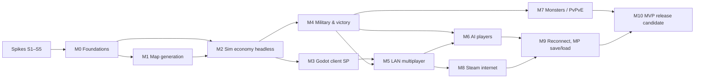

# 09 — Roadmap

**Capacity basis:** solo developer, part-time, ~12 h/week ([USER-ANSWERS](handoff/USER-ANSWERS.md) Q1). Effort is given in **weeks at 12 h/week** (1 w ≈ 12 h). Estimates are rough (±40 %); AI-agent assistance is assumed but not counted as extra capacity.
**Gate:** nothing below starts before the user approves the ADRs ([decisions/](decisions/README.md)). Spikes need explicit user permission ([ORIGINAL-BRIEF §1](handoff/ORIGINAL-BRIEF.md)).

## 1. Dependency overview

## 2. Spikes (throwaway, each needs user approval)
| ID | Question to answer | Acceptance (measurable) | Effort |
|---|---|---|---|
| S1 | Does a Godot .NET project + plain `net8.0` sim library export and run on Win x64, macOS universal (arm64+x64), Linux x64? Do analyzers block `float`? | 3 exported builds start and print identical hash of a 10 000-step `Pcg32`+`Fix` computation; build fails when a `float` is added to the sim | 1.5 w |
| S2 | Can Godot render 5 000 animated low-poly settlers + 512² terrain at 60 FPS? | ≥ 60 FPS at 1080p on reference machine, ≥ 30 FPS on an integrated GPU | 1.5 w |
| S3 | Steam P2P with Steamworks.NET (AppID 480) and Godot `ENetConnection` behind one `ITransport` | two machines exchange 10 000 messages over SDR and over ENet LAN, < 1 % loss handled by redundancy | 1 w |
| S4 | Integer noise + start placement produce plausible fair maps; tune `Dmin`, `Rf`, `Lmin` | 100 seeds × 3 sizes generate; ≥ 80 % pass F1–F11 first attempt; XL < 2 s | 1 w |
| S5 | Logistics + HPA* scale | headless: 5 000 carriers, 300 buildings, tick ≤ 20 ms on reference machine | 1.5 w |
| | **Subtotal** | | **6.5 w** |

## 3. Milestones
| # | Milestone | Key tasks | Acceptance criteria (all measurable) | Effort |
|---|---|---|---|---|
| M0 | Foundations | repo layout ([01-architecture §9](01-architecture.md)); CI 4 runners; analyzers; `Fix`, `Pcg32`, XxHash, canonical serializer; command & `.rblog` format; `Rebuild.Tools` skeleton | CI green on 4 runners; cross-OS hash job compares a 1 M-step RNG/`Fix` sequence; `Fix` property tests 10 000 cases green; adding `float` to Sim fails the build | 4 w |
| M1 | Map generation | full pipeline ([03-mapgen](03-mapgen.md)); validation F1–F11; retries; share code; `mapgen` CLI with PNG preview | 24 golden hashes identical on 4 runners; XL attempt ≤ 1.5 s, p99 ≤ 4 s; first-attempt pass ≥ 90 % over 1 000 seeds/size | 6 w |
| M2 | Sim economy (headless) | tiles, territory, 24 buildings, construction, production, logistics, settlers, tools, A* + HPA*, stats | scripted build order reaches first sword by game minute 30; 5 000 settlers ≤ 20 ms/tick; save/load equivalence test green; 2 golden replays | 10 w |
| M3 | Godot client, single-player | terrain chunks, MultiMesh units, interpolation, camera, build menu, HUD, stats panels, Kenney asset mapping, SP via `LoopbackTransport` | 30-min SP sandbox playable; 60 FPS @1080p on reference machine; architecture test: client assembly has no write access to sim state | 8 w |
| M4 | Military & victory | barracks, towers, territory capture, duel combat, rank-up, Conquest victory, surrender | scripted 1v1 ends with correct winner identically on 4 runners; combat golden replay | 5 w |
| M5 | LAN multiplayer | lockstep host-sealed turns, ENet transport, LAN discovery, lobby (slots/teams/map preview/seed share/save map), map-hash check, desync detection + dumps, pause, game speed | 4 machines with mixed OS play 60 min without desync; with 150 ms latency + 5 % loss command latency ≤ 600 ms and no stall > 1 s; injected desync detected in ≤ 1 turn and dumps written | 6 w |
| M6 | AI players | perception, strategy, economy/expansion/military managers, 3 difficulties, AI takeover | Hard beats Normal ≥ 70 %, Normal beats Easy ≥ 80 % (40 soak matches each); every AI trains first soldier before minute 25; takeover after disconnect continues the economy | 8 w |
| M7 | Monsters & PvPvE | lairs, wave scheduler, monster state machine, Survival & Lair-hunt victory | waves follow [04-game-modes §5](04-game-modes.md) formula (unit test); 4-player PvPvE soak 60 min without desync; Survival victory triggers correctly | 4 w |
| M8 | Steam internet play | `SteamTransport`, Steam lobbies, invites, Steam build pipeline | two players behind different NATs (one on a mobile hotspot/CGNAT) play 30 min via SDR without desync | 4 w |
| M9 | MP robustness | reconnect with snapshot, MP save/load, host-loss auto-save, slow-peer speed cap | killed client reconnects within 60 s with matching hash; saved MP game resumes in a new lobby with identical subsequent hashes; host crash leaves loadable auto-saves on all clients | 4 w |
| M10 | MVP release candidate | UX pass, settings, audio placeholders, onboarding hints, macOS signing/notarization, Steam depots for 3 OS | CI produces signed builds for 3 OS; 10 external playtest sessions; 0 desyncs and 0 crashes in the last 5 sessions | 6 w |
| | **Milestones subtotal** | | | **65 w** |

**Total MVP ≈ 71.5 weeks ≈ 860 h ≈ 16–17 months at 12 h/week; with 25 % contingency ≈ 21 months.** This is large for a solo part-time project; the scope levers are listed in [open-questions](open-questions.md) (e.g. ship LAN + Steam before AI, drop Gold chain, reduce to 4 players).

## 4. Post-MVP backlog (not estimated in detail)
Custom relay server (`RelayTransport` + `Rebuild.Relay`, ~3 w, [ADR 0004](decisions/0004-internet-transport.md)); host migration; roads/speed paths; second soldier type (archer); fog of war; spectator & replay viewer; more tribes; map editor.
